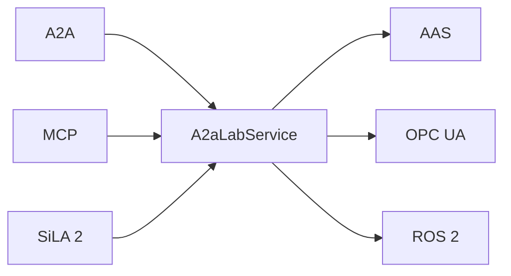

# A2A-LAB devkit

[](https://github.com/A3Analytics/a2a-lab-dev-kit-rs/actions/workflows/a2a-tck.yml)
[](https://github.com/A3Analytics/a2a-lab-dev-kit-rs/actions/workflows/sila2-interop.yml)

A2A-LAB devkit is a Rust crate for lab logs, metrics, and tasks over A2A, MCP, SiLA 2, AAS, OPC UA, and ROS 2.

## Features

- Supports lab logs, metrics, and tasks over Agent2Agent (A2A) and Model Context Protocol (MCP).
- Serves that lab to Standardization in Lab Automation (SiLA) 2 clients.
- Reads equipment from an Asset Administration Shell (AAS) catalog.
- Reads Open Platform Communications Unified Architecture (OPC UA) equipment history.
- Supplies live OPC UA readings through `LiveSource`. [Upcoming]
- Exposes Robot Operating System 2 (ROS 2) actions as lab tasks.

## Call path

The following diagram shows how the industry standards interface with A2A-Lab:



## Run the memory example

Run these commands from the repository root.

1. Install the tools:

   ```bash
   mise install
   ```

2. Run the [memory lab example](examples/memory_lab.rs):

   ```bash
   mise exec -- cargo run --example memory_lab
   ```

## Wiki

Read the [A2A-LAB devkit overview](https://github.com/A3Analytics/a2a-lab-dev-kit-rs/wiki/Home).

## Open the crate documentation

Generate the application programming interface (API) documentation with this command:

```bash
mise exec -- cargo doc --no-deps --open
```

## Check the crate

1. Build the crate:

   ```bash
   mise run build
   ```

2. Test the crate:

   ```bash
   mise run test
   ```

3. Run the quality checks:

   ```bash
   mise run quality
   ```

`mise run quality` checks formatting, the SiLA matrix, the Wiki, complexity, duplication, compilation, Clippy, tests, the A2A TCK, and the SiLA provider checks.

The Wiki action publishes public Backlog docs.
