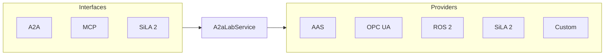

# A2A-LAB devkit

[](https://github.com/A3Analytics/a2a-lab-dev-kit-rs/actions/workflows/a2a-tck.yml)

A2A-LAB devkit is a Rust crate for lab logs, metrics, tasks, and images. Agent2Agent (A2A) and Model Context Protocol (MCP) expose all twelve operations. SiLA 2 serves logs, metrics, tasks, and named-source images. AAS, OPC UA, and ROS 2 stay on logs, metrics, and tasks. Image fields and limits are in the [A2A-LAB primitives](https://github.com/A3Analytics/a2a-lab-dev-kit-rs/wiki/Primitives).

The A2A 1.0 badge reports the official A2A protocol Technology Compatibility Kit (TCK) workflow for this devkit. It does not report A2A-LAB compliance.

## Features

- Supports lab logs, metrics, tasks, and images over Agent2Agent (A2A) and Model Context Protocol (MCP).
- Serves logs, metrics, tasks, and named-source images to Standardization in Lab Automation (SiLA) 2 clients. Image bytes use SiLA binary download.
- Connects to a remote SiLA 2 server and exposes configured members as lab tasks, logs, and metrics.
- Reads equipment from an AAS catalog.
- Reads Open Platform Communications Unified Architecture (OPC UA) equipment history.
- Supplies live OPC UA readings through `LiveSource`. [Upcoming]
- Exposes Robot Operating System 2 (ROS 2) actions as lab tasks.

## Interfaces and providers

The following diagram shows the interfaces and providers around `A2aLabService`:



A2A, MCP, and SiLA 2 call `A2aLabService`. `A2aLabService` uses AAS, OPC UA, ROS 2, SiLA 2, and Custom. SiLA 2 is both the inbound interface and a remote provider. The inbound server also serves named-source images through binary download.

## Run the logs, metrics, and tasks example

Run these commands from the repository root.

1. Install the tools:

   ```bash
   mise install
   ```

2. Run the [logs, metrics, and tasks example](examples/logs_metrics_tasks.rs):

   ```bash
   mise exec -- cargo run --example logs_metrics_tasks
   ```

## Check A2A-LAB compliance

A2A-LAB compliance tests deterministic lab-operation behavior and A2A/MCP parity. It is separate from the official A2A protocol TCK and does not establish certification.

Use [Adopt A2A-LAB compliance](https://github.com/A3Analytics/a2a-lab-dev-kit-rs/wiki/Adopt-A2A-LAB-compliance) to create fixtures, run the profile locally or in a consumer-owned GitHub Actions workflow, retain the JSON report, and display the workflow badge. [A2A-LAB compliance profile](https://github.com/A3Analytics/a2a-lab-dev-kit-rs/wiki/A2A-LAB-compliance-profile) defines profile `1.0.0`, required cases, parity, and report fields.

## Wiki

Read the [A2A-LAB devkit overview](https://github.com/A3Analytics/a2a-lab-dev-kit-rs/wiki/Home).

## Open the crate documentation

Generate the application programming interface (API) documentation with this command:

```bash
mise exec -- cargo doc --no-deps --open
```

## Check the crate

1. Build the crate:

   ```bash
   mise run build
   ```

2. Test the crate:

   ```bash
   mise run test
   ```

3. Run the quality checks:

   ```bash
   mise run quality
   ```

`mise run quality` checks formatting, the SiLA matrix, the Wiki, complexity, duplication, compilation, Clippy, tests, the A2A TCK, and the SiLA provider checks.

The Wiki action publishes public Backlog docs.
