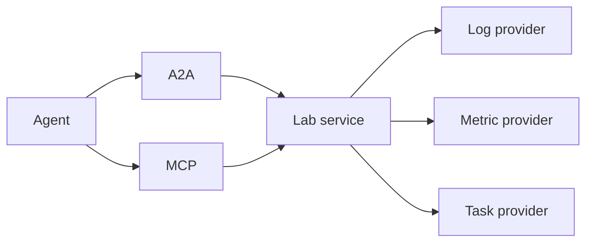

# A2A-LAB devkit

[](https://github.com/A3Analytics/a2a-lab-dev-kit-rs/actions/workflows/a2a-tck.yml)
[](https://github.com/A3Analytics/a2a-lab-dev-kit-rs/actions/workflows/sila2-interop.yml)

A2A-LAB devkit is a Rust library for lab logs, metrics, and tasks. The crate name is `a2a-lab-dev-kit`.

Provider traits are the source of truth.

`LabService` runs seven operations.

Agent2Agent (A2A) and Model Context Protocol (MCP) call that service.

## Call path

The following diagram shows an agent reaching the lab service through A2A or MCP:



The preceding diagram has these connections:

- An agent calls A2A or MCP.
- Both paths reach the lab service (`LabService`).
- The lab service calls the log provider (`LogProvider`).
- The lab service calls the metric provider (`MetricProvider`).
- The lab service calls the task provider (`TaskProvider`).

The overview page shows the default A2A path through the MCP lab client.

## Run the memory example

Run these commands from the repository root.

1. Install the tools:

   ```bash
   mise install
   ```

2. Run the [memory lab example](examples/memory_lab.rs):

   ```bash
   mise exec -- cargo run --example memory_lab
   ```

## Features

The default features are `aas`, `opcua`, and `sila2`.

They enable Asset Administration Shell (AAS), Open Platform Communications Unified Architecture (OPC UA), and Standardization in Lab Automation (SiLA) 2.

Robot Operating System 2 (ROS 2) code in the `ros2` module is always compiled.

`OpcUaClient` supplies live OPC UA readings through `LiveSource`. [Upcoming] See the OPC UA page in the following table.

## Public documentation

These pages are the public documentation:

| Page                                                                                                                  |
| --------------------------------------------------------------------------------------------------------------------- |
| [A2A-LAB devkit overview](https://github.com/A3Analytics/a2a-lab-dev-kit-rs/wiki/Home)                                |
| [Run the memory lab](https://github.com/A3Analytics/a2a-lab-dev-kit-rs/wiki/Run-the-memory-lab)                       |
| [Serve A2A and MCP](https://github.com/A3Analytics/a2a-lab-dev-kit-rs/wiki/Serve-A2A-and-MCP)                         |
| [Run a scripted industrial lab](https://github.com/A3Analytics/a2a-lab-dev-kit-rs/wiki/Run-a-scripted-industrial-lab) |
| [Expose ROS 2 actions as tasks](https://github.com/A3Analytics/a2a-lab-dev-kit-rs/wiki/Expose-ROS-2-actions-as-tasks) |
| [A2A](https://github.com/A3Analytics/a2a-lab-dev-kit-rs/wiki/A2A)                                                     |
| [MCP](https://github.com/A3Analytics/a2a-lab-dev-kit-rs/wiki/MCP)                                                     |
| [Asset Administration Shell](https://github.com/A3Analytics/a2a-lab-dev-kit-rs/wiki/AAS)                              |
| [OPC UA](https://github.com/A3Analytics/a2a-lab-dev-kit-rs/wiki/OPC-UA)                                               |
| [SiLA 2](https://github.com/A3Analytics/a2a-lab-dev-kit-rs/wiki/SiLA-2)                                               |
| [ROS 2](https://github.com/A3Analytics/a2a-lab-dev-kit-rs/wiki/ROS-2)                                                 |

## Open the crate documentation

Generate the application programming interface (API) documentation with this command:

```bash
mise exec -- cargo doc --no-deps --open
```

## Check the crate

1. Build the crate:

   ```bash
   mise run build
   ```

2. Test the crate:

   ```bash
   mise run test
   ```

3. Run the quality checks:

   ```bash
   mise run quality
   ```

`mise run quality` checks formatting, the SiLA matrix, the Wiki, complexity, duplication, compilation, Clippy, tests, the A2A TCK, and the SiLA provider checks.

The Wiki action publishes public Backlog docs.
