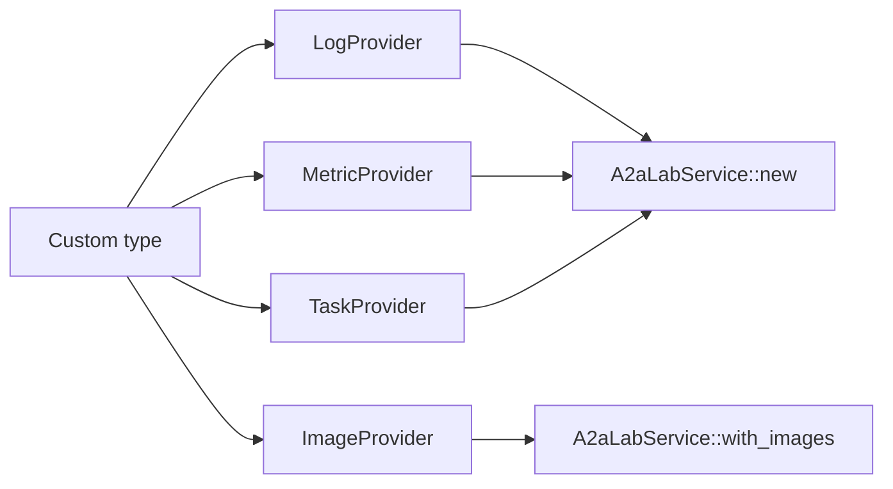

# Implement a custom provider

Implement `LogProvider`, `MetricProvider`, `TaskProvider`, `ImageProvider`, or a combination of those traits. Pass the log, metric, and task implementations to `A2aLabService::new`. Pass an image implementation to `with_images`. [Custom](<../../reference/custom/doc-20 - Custom.md>) defines that provider role.

The following diagram shows where the implementation sits:



In the preceding diagram, a custom type implements `LogProvider`, `MetricProvider`, `TaskProvider`, or `ImageProvider`. `A2aLabService::new` accepts the log, metric, and task implementations. `A2aLabService::with_images` accepts `ImageProvider`.

## Implement the traits

The provider type is `Send` and `Sync`. Each method returns `Result<_, A2aLabError>`.

`LogProvider` has two methods:

- `list_sources` returns a page of `LogSource`.
- `query` returns a page of `LogRecord` for one source.

`MetricProvider` has two methods:

- `list_metrics` returns a page of `MetricDescriptor`.
- `query` returns a page of `MetricPoint` for one metric.

`TaskProvider` has four methods:

- `list_tasks` returns a page of `TaskDefinition`.
- `start` accepts a run and returns a `TaskRun`. The run id is the task id.
- `status` returns that `TaskRun`.
- `cancel` stops a run. The default returns `A2aLabError::unavailable`.

`ImageProvider` has five methods:

- `list_image_sources` returns a page of `ImageSource`.
- `list_images` returns a page of `ImageDescriptor` for one source. The page is metadata only.
- `search_images` returns a page of `ImageDescriptor`. The search needs a half-open UTC range, nonblank text, or both. A source id can narrow it. A source id alone is not a search. The page is metadata only.
- `get_image` returns one `Image`, including its inline bytes.
- `get_current_image` returns the current `Image` for one source, including its inline bytes. The request names that source. It does not omit an image id. The provider defines the current frame. It can be newly captured, taken from video, or the latest stored image.

Source fields, descriptor fields, and inline bytes are defined in the [A2A-LAB primitives](<../../reference/primitives/doc-17 - A2A-LAB-primitives.md>). The provider supplies the frames.

`Image::new` uses the 64 MiB default. A provider that creates a larger payload uses `Image::with_transport`. Set the same decoded-byte maximum on the service with `A2aLabService::with_image_transport` and on each client with `A2aClient::with_image_transport` or `McpLab::connect_with`. Pass a raised Model Context Protocol (MCP) limit to `connect_with` before the connection opens.

Return pages with `Page::new`. Leave the next cursor absent on the last page. Read the requested page from `request.page.cursor()` and `request.page.limit()`.

A query keeps records or samples inside `request.range`. The range is a half-open Coordinated Universal Time (UTC) interval, `[start, end)`. An unknown id returns `A2aLabError::not_found`.

When `start` is called with `wait: true`, `A2aLabService` polls `status` until the state is terminal. The default wait is 60 seconds. `completed`, `failed`, and `canceled` are terminal. Return `Completed` from `start` when the work is already finished.

The [A2A-LAB primitives](<../../reference/primitives/doc-17 - A2A-LAB-primitives.md>) define the identifiers, timestamps, pages, and error codes.

## Pass the providers to the service

`A2aLabService::new` takes one log provider, one metric provider, and one task provider. Image operations stay unavailable until `with_images`. Use `MemoryLogs`, `MemoryMetrics`, `MemoryTasks`, or `MemoryImages` for a primitive the custom type leaves to this crate. Attach an image provider without replacing that constructor:

```rust
let service = A2aLabService::new(OvenLogs::new()?, MemoryMetrics::new(), MemoryTasks::new())
    .with_images(MemoryImages::new());
```

The [custom provider example](../../../../examples/custom_provider.rs) implements `LogProvider` for one oven log and uses the in-memory metric and task providers:

```rust
let service = A2aLabService::new(OvenLogs::new()?, MemoryMetrics::new(), MemoryTasks::new());
```

`OvenLogs::list_sources` returns the source `oven`. `OvenLogs::query` returns the record `ready` when that record's timestamp is inside the requested range.

## Run the example

Run this command from the repository root:

```bash
mise exec -- cargo run --example custom_provider
```

The example prints this text:

```text
log source: oven
```

## Use the SiLA provider

A remote SiLA 2 server does not need a new trait implementation. `SilaProvider::connect` reads `SilaProviderConfig` and returns one value that implements `LogProvider`, `MetricProvider`, and `TaskProvider`. It does not implement `ImageProvider`. The inbound `SilaServer` serves images only when the lab service has an `ImageProvider`. The three-provider constructor below leaves image operations unavailable.

```rust
let provider = SilaProvider::connect(config).await?;
let service = A2aLabService::new(provider.clone(), provider.clone(), provider);
```

[SiLA 2](<../../reference/sila-2/doc-8 - SiLA-2.md>) defines the endpoint, certificate, and binding configuration. The [SiLA provider example](../../../../examples/sila_provider.rs) (`examples/sila_provider.rs`) prints `log record: ready`.

Run this command from the repository root:

```bash
mise exec -- cargo run --example sila_provider
```

## Related

- [Custom](<../../reference/custom/doc-20 - Custom.md>)
- [A2A-LAB primitives](<../../reference/primitives/doc-17 - A2A-LAB-primitives.md>)
- [Implementations](<../../reference/implementations/doc-18 - Implementations.md>)
- [Run the memory lab](<../memory-lab/doc-12 - Run-the-memory-lab.md>)
