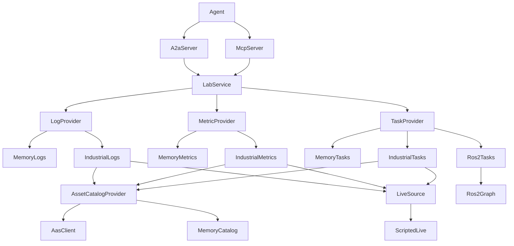

# Lab SDK overview

## Role in this SDK

`a2a-lab-sdk` is a Rust library for lab logs, metrics, and tasks. Provider traits are the source of truth. `LabService` checks pages and time ranges, calls `LogProvider`, `MetricProvider`, and `TaskProvider`, and stores an A2A task snapshot. A2A and MCP both call that service.

An agent call enters through A2A or MCP. `LabService` fans out to the three provider traits. Each trait is backed by one implementation chosen when the service is built.

## What this crate implements

`LabCommand` has seven operations. A2A skill ids and MCP tool names are in parentheses:

1. `list_log_sources` (`list-log-sources`, `list_log_sources`) lists log sources.
2. `query_logs` (`query-logs`, `query_logs`) reads structured records for one source.
3. `list_metrics` (`list-metrics`, `list_metrics`) lists metric descriptors.
4. `query_metric` (`query-metric`, `query_metric`) reads samples for one metric.
5. `list_tasks` (`list-tasks`, `list_tasks`) lists task definitions.
6. `start_task` (`start-task`, `start_task`) starts a task with a JSON object and returns the run.
7. `get_task_status` (`get-task-status`, `get_task_status`) reads one run.

Query requests carry a `TimeRange`. The range is half-open UTC: `TimeRange` documents `[start, end)`, `start` must be strictly before `end`, and `contains` is true when the timestamp is greater than or equal to `start` and strictly less than `end`. `UtcTimestamp` accepts RFC 3339 text whose offset is `Z`, `+00:00`, or `-00:00`.

List and query requests also carry a `PageRequest`. The limit must be from 1 to `MAX_PAGE_LIMIT` (1000). The default limit is 100. A cursor is an optional string of ASCII digits. Identifiers such as `SourceId`, `MetricId`, `TaskId`, and `RunId` are 1 to 128 characters of ASCII letters, digits, or `.` `_` `:` `-`. `SdkError::code` is `invalid`, `not_found`, `unavailable`, `transport`, or `protocol`.

In-memory providers are `MemoryLogs`, `MemoryMetrics`, `MemoryTasks`, and `MemoryCatalog`. `IndustrialLabBuilder` can share one catalog and one `LiveSource` across `IndustrialLogs`, `IndustrialMetrics`, and `IndustrialTasks`. `ScriptedLive` is the `LiveSource` implemented in this crate.

## Entry points

`LabService::new` takes the three providers. `LabService::share` returns `Arc<dyn LabApi>` for `A2aServer` and `McpServer`. `version` returns the package version.

Protocol and equipment pages:

- [A2A](<../reference/a2a/doc-4 - A2A.md>)
- [MCP](<../reference/mcp/doc-5 - MCP.md>)
- [Asset Administration Shell](<../reference/aas/doc-6 - Asset-Administration-Shell.md>)
- [OPC UA](<../reference/opc-ua/doc-7 - OPC-UA.md>)
- [SiLA 2](<../reference/sila-2/doc-8 - SiLA-2.md>)
- [ROS 2](<../reference/ros-2/doc-9 - ROS-2.md>)

The repository [README](../../../README.md) shows `LabService` with the memory providers, `A2aServer::listen`, and `McpServer::serve_http`.

## Related

- [README](../../../README.md)
- [A2A](<../reference/a2a/doc-4 - A2A.md>)
- [MCP](<../reference/mcp/doc-5 - MCP.md>)
- [Asset Administration Shell](<../reference/aas/doc-6 - Asset-Administration-Shell.md>)
- [OPC UA](<../reference/opc-ua/doc-7 - OPC-UA.md>)
- [SiLA 2](<../reference/sila-2/doc-8 - SiLA-2.md>)
- [ROS 2](<../reference/ros-2/doc-9 - ROS-2.md>)
- [Lab SDK architecture](<../technical/architecture/doc-1 - Lab-SDK-architecture.md>)
- [A2A and MCP protocols](<../technical/protocol/doc-2 - A2A-and-MCP-protocols.md>)
- [Industrial equipment connectors](<../technical/industrial/doc-3 - Industrial-equipment-connectors.md>)
