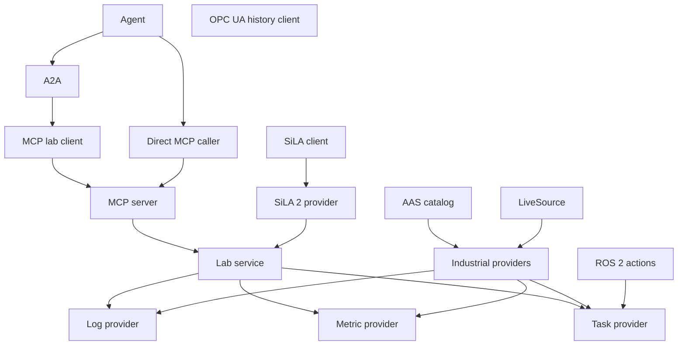

# A2A-LAB devkit overview

A2A-LAB devkit routes agent calls to logs, metrics, and tasks. The crate name is `a2a-lab-dev-kit`.

Provider traits are the source of truth.

`LabService` runs seven operations.

Six standards connect to that service.

## Standards

The following diagram shows how each standard meets the lab service:

The preceding diagram has these connections:

- An agent calls Agent2Agent (A2A) or a direct Model Context Protocol (MCP) caller.
- A2A calls the MCP lab client (`McpLab`).
- The MCP lab client and the direct caller reach the MCP server (`McpServer`).
- The MCP server calls the lab service (`LabService`).
- A Standardization in Lab Automation (SiLA) client calls the SiLA 2 provider (`SilaServer`).
- The SiLA 2 provider calls the lab service.
- The lab service calls the log, metric, and task providers.
- The Asset Administration Shell (AAS) catalog and `LiveSource` feed the industrial providers.
- The industrial providers fill the log, metric, and task roles.
- Robot Operating System 2 (ROS 2) actions supply the task provider.
- The Open Platform Communications Unified Architecture (OPC UA) history client stays separate from `LiveSource`.

The following sections describe how each standard operates with A2A-LAB devkit.

### Agent2Agent

A2A is an inbound agent protocol. `A2aServer` accepts lab commands. On the default path, it calls MCP tools through `McpLab`.

For more information, see [A2A](<../reference/a2a/doc-4 - A2A.md>).

### Model Context Protocol

MCP is the other inbound agent protocol. `McpServer` exposes the seven operations as tools. A2A and a direct MCP client call those tools.

For more information, see [MCP](<../reference/mcp/doc-5 - MCP.md>).

### Asset Administration Shell

AAS is an outbound catalog. `AasClient` reads shells and binding submodels. Industrial providers use those bindings. AAS is not one of the seven agent operations.

For more information, see [Asset Administration Shell](<../reference/aas/doc-6 - Asset-Administration-Shell.md>).

### OPC UA

OPC UA is an outbound history client. Industrial providers read samples through `LiveSource`. `ScriptedLive` is that source in this crate. `OpcUaClient::read_history` reads one node and is not a `LiveSource`.

Future work is live OPC UA readings through `LiveSource`.

For more information, see [OPC UA](<../reference/opc-ua/doc-7 - OPC-UA.md>).

### SiLA 2

SiLA 2 is an inbound Feature Provider. `SilaServer` serves the same lab interface as A2A and MCP. It does not open a remote SiLA client.

For more information, see [SiLA 2](<../reference/sila-2/doc-8 - SiLA-2.md>).

### ROS 2

ROS 2 actions become lab tasks. `Ros2Tasks` implements `TaskProvider` over an in-process graph. There is no Data Distribution Service (DDS) link and no ROS Client Library (RCL) link.

Future work is a ROS 2 graph backed by DDS or RCL.

For more information, see [ROS 2](<../reference/ros-2/doc-9 - ROS-2.md>).

## Operations

Each operation lists the A2A skill id, then the MCP tool name.

1. `list_log_sources` (`list-log-sources`, `list_log_sources`) lists log sources.
2. `query_logs` (`query-logs`, `query_logs`) reads log records for one source.
3. `list_metrics` (`list-metrics`, `list_metrics`) lists metrics.
4. `query_metric` (`query-metric`, `query_metric`) reads samples for one metric.
5. `list_tasks` (`list-tasks`, `list_tasks`) lists tasks.
6. `start_task` (`start-task`, `start_task`) waits until the run is terminal unless `wait` is false.
7. `get_task_status` (`get-task-status`, `get_task_status`) reads one run.

The default `start_task` timeout is 60 seconds.

## Time ranges

Time ranges are half-open Coordinated Universal Time (UTC) intervals, `[start, end)`.

A timestamp in the range is greater than or equal to `start` and less than `end`.

## Implementations

This table lists the implementations behind the provider traits:

| Implementation                                           | Role                                                        |
| -------------------------------------------------------- | ----------------------------------------------------------- |
| `MemoryLogs`                                             | In-memory `LogProvider`                                     |
| `MemoryMetrics`                                          | In-memory `MetricProvider`                                  |
| `MemoryTasks`                                            | In-memory `TaskProvider`                                    |
| `AasClient`                                              | Asset Administration Shell (AAS) `AssetCatalogProvider`     |
| `MemoryCatalog`                                          | In-memory `AssetCatalogProvider`                            |
| `ScriptedLive`                                           | In-crate `LiveSource`                                       |
| `Ros2Tasks`                                              | `TaskProvider` for Robot Operating System 2 (ROS 2) actions |
| `IndustrialLogs`, `IndustrialMetrics`, `IndustrialTasks` | Use `AssetCatalogProvider` and `LiveSource`                 |

## Related pages

Read these guides:

- [Run the memory lab](<../guide/memory-lab/doc-12 - Run-the-memory-lab.md>)
- [Serve A2A and MCP](<../guide/a2a-and-mcp/doc-13 - Serve-A2A-and-MCP.md>)
- [Run a scripted industrial lab](<../guide/scripted-industrial/doc-14 - Run-a-scripted-industrial-lab.md>)
- [Expose ROS 2 actions as tasks](<../guide/ros2-tasks/doc-15 - Expose-ROS-2-actions-as-tasks.md>)
- [README](../../../README.md)
