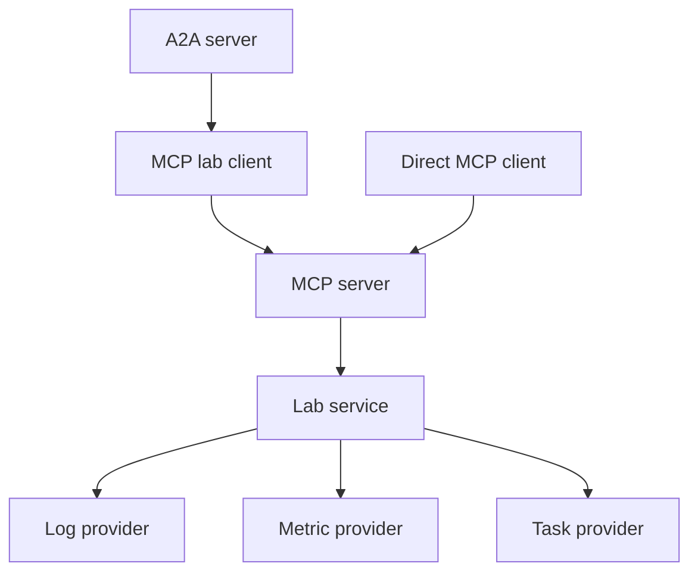

# Lab dev kit overview

`a2a-lab-dev-kit` routes agent calls to logs, metrics, and tasks.

Provider traits are the source of truth.

`LabService` runs seven operations.

Agent2Agent (A2A) and Model Context Protocol (MCP) call that service.

## Call path

The following diagram shows the default path from an agent to the provider traits:

The preceding diagram has these connections:

- The A2A server (`A2aServer`) calls the MCP lab client (`McpLab`).
- The MCP lab client calls the MCP server (`McpServer`).
- A direct MCP client calls the MCP server.
- The MCP server calls the lab service (`LabService`).
- The lab service calls the log provider (`LogProvider`).
- The lab service calls the metric provider (`MetricProvider`).
- The lab service calls the task provider (`TaskProvider`).

## Operations

Each operation lists the A2A skill id, then the MCP tool name.

1. `list_log_sources` (`list-log-sources`, `list_log_sources`) lists log sources.
2. `query_logs` (`query-logs`, `query_logs`) reads log records for one source.
3. `list_metrics` (`list-metrics`, `list_metrics`) lists metrics.
4. `query_metric` (`query-metric`, `query_metric`) reads samples for one metric.
5. `list_tasks` (`list-tasks`, `list_tasks`) lists tasks.
6. `start_task` (`start-task`, `start_task`) waits until the run is terminal unless `wait` is false.
7. `get_task_status` (`get-task-status`, `get_task_status`) reads one run.

The default `start_task` timeout is 60 seconds.

## Time ranges

Time ranges are half-open Coordinated Universal Time (UTC) intervals, `[start, end)`.

A timestamp in the range is greater than or equal to `start` and less than `end`.

## Implementations

This table lists the implementations behind the provider traits:

| Implementation | Role |
| --- | --- |
| `MemoryLogs` | In-memory `LogProvider` |
| `MemoryMetrics` | In-memory `MetricProvider` |
| `MemoryTasks` | In-memory `TaskProvider` |
| `AasClient` | Asset Administration Shell (AAS) `AssetCatalogProvider` |
| `MemoryCatalog` | In-memory `AssetCatalogProvider` |
| `ScriptedLive` | In-crate `LiveSource` |
| `Ros2Tasks` | `TaskProvider` for Robot Operating System 2 (ROS 2) actions |
| `IndustrialLogs`, `IndustrialMetrics`, `IndustrialTasks` | Use `AssetCatalogProvider` and `LiveSource` |

## Related pages

Read these related pages, including Open Platform Communications Unified Architecture (OPC UA) and Standardization in Lab Automation (SiLA) 2:

- [Run the memory lab](<../guide/memory-lab/doc-12 - Run-the-memory-lab.md>)
- [Serve A2A and MCP](<../guide/a2a-and-mcp/doc-13 - Serve-A2A-and-MCP.md>)
- [Run a scripted industrial lab](<../guide/scripted-industrial/doc-14 - Run-a-scripted-industrial-lab.md>)
- [Expose ROS 2 actions as tasks](<../guide/ros2-tasks/doc-15 - Expose-ROS-2-actions-as-tasks.md>)
- [A2A](<../reference/a2a/doc-4 - A2A.md>)
- [MCP](<../reference/mcp/doc-5 - MCP.md>)
- [Asset Administration Shell](<../reference/aas/doc-6 - Asset-Administration-Shell.md>)
- [OPC UA](<../reference/opc-ua/doc-7 - OPC-UA.md>)
- [SiLA 2](<../reference/sila-2/doc-8 - SiLA-2.md>)
- [ROS 2](<../reference/ros-2/doc-9 - ROS-2.md>)
- [README](../../../README.md)
