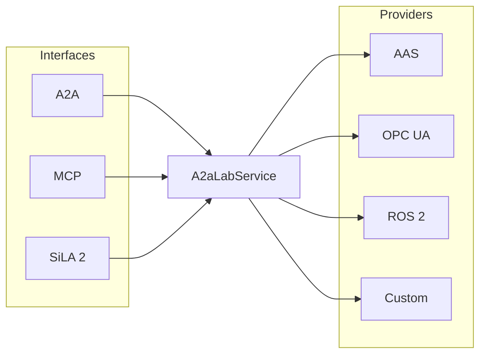

# A2A-LAB devkit overview

A2A-LAB devkit routes client calls to lab logs, metrics, and tasks. Those values are the [A2A-LAB primitives](<../reference/primitives/doc-17 - A2A-LAB-primitives.md>). The crate name is `a2a-lab-dev-kit`.

## Interfaces and providers

The following diagram shows the interfaces and providers around `A2aLabService`. [Interfaces and providers](<../reference/interfaces-and-providers/doc-19 - Interfaces-and-providers.md>) defines those terms.

In the preceding diagram, Agent2Agent (A2A), Model Context Protocol (MCP), and Standardization in Lab Automation (SiLA) 2 are interfaces. They call `A2aLabService`. AAS, Open Platform Communications Unified Architecture (OPC UA), Robot Operating System 2 (ROS 2), and Custom are providers. `A2aLabService` uses those providers.

## Related pages

Read these pages:

- [Interfaces and providers](<../reference/interfaces-and-providers/doc-19 - Interfaces-and-providers.md>)
- [A2A-LAB primitives](<../reference/primitives/doc-17 - A2A-LAB-primitives.md>)
- [Implementations](<../reference/implementations/doc-18 - Implementations.md>)
- [Run the memory lab](<../guide/memory-lab/doc-12 - Run-the-memory-lab.md>)
- [Serve A2A and MCP](<../guide/a2a-and-mcp/doc-13 - Serve-A2A-and-MCP.md>)
- [Expose ROS 2 actions as tasks](<../guide/ros2-tasks/doc-15 - Expose-ROS-2-actions-as-tasks.md>)
- [Implement a custom provider](<../guide/custom-provider/doc-21 - Implement-a-custom-provider.md>)
- [README](../../../README.md)
