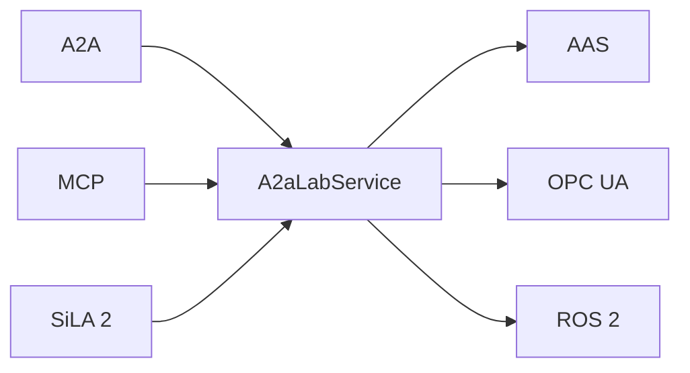

# A2A-LAB devkit overview

A2A-LAB devkit routes agent calls to logs, metrics, and tasks. Those values are the [A2A-LAB primitives](<../reference/primitives/doc-17 - A2A-LAB-primitives.md>). The crate name is `a2a-lab-dev-kit`.

Provider traits are the source of truth. `A2aLabService` runs seven operations.

## Standards

The following diagram shows the six standards around `A2aLabService`:

In the preceding diagram, Agent2Agent (A2A), Model Context Protocol (MCP), and Standardization in Lab Automation (SiLA) 2 call `A2aLabService`. `A2aLabService` uses the Asset Administration Shell (AAS), Open Platform Communications Unified Architecture (OPC UA), and Robot Operating System 2 (ROS 2).

- [A2A](<../reference/a2a/doc-4 - A2A.md>) and [MCP](<../reference/mcp/doc-5 - MCP.md>) are how agents call the lab.
- [SiLA 2](<../reference/sila-2/doc-8 - SiLA-2.md>) serves that same lab to SiLA clients.
- [Asset Administration Shell](<../reference/aas/doc-6 - Asset-Administration-Shell.md>) supplies the equipment catalog.
- [OPC UA](<../reference/opc-ua/doc-7 - OPC-UA.md>) reads equipment history.
- [ROS 2](<../reference/ros-2/doc-9 - ROS-2.md>) exposes actions as lab tasks.

## Operations

`A2aLabService` runs these operations:

1. `list_log_sources` lists log sources.
2. `query_logs` reads records for one source.
3. `list_metrics` lists metrics.
4. `query_metric` reads samples for one metric.
5. `list_tasks` lists tasks.
6. `start_task` starts a task.
7. `get_task_status` reads one run.

Time ranges are half-open Coordinated Universal Time (UTC) intervals, `[start, end)`.

## Related pages

Read these pages:

- [Run the memory lab](<../guide/memory-lab/doc-12 - Run-the-memory-lab.md>)
- [Serve A2A and MCP](<../guide/a2a-and-mcp/doc-13 - Serve-A2A-and-MCP.md>)
- [Expose ROS 2 actions as tasks](<../guide/ros2-tasks/doc-15 - Expose-ROS-2-actions-as-tasks.md>)
- [Implementations](<../reference/implementations/doc-18 - Implementations.md>)
- [README](../../../README.md)
