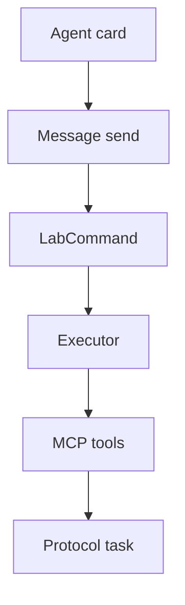

# A2A

This crate serves Agent2Agent (A2A) 1.0 for lab commands.

## Role

`A2aServer` accepts any `LabApi`.

`McpLab::connect_default` calls Model Context Protocol (MCP) tools at `http://127.0.0.1:31001/mcp`.

A lab command is a data part with media type `application/json`.

The result uses the same media type.

Protocol task ids are A2A UUIDs.

A lab run id is separate.

A lab command takes the following path:

In the preceding diagram, the agent card leads to message send.

Message send carries a LabCommand.

The LabCommand reaches the executor.

The executor calls MCP tools.

MCP tools return a protocol task.

## Transports

`A2aServer` speaks HTTP+JSON, JSON-RPC, and gRPC.

`A2aClient` speaks HTTP+JSON.

HTTP+JSON and JSON-RPC share one listener.

gRPC uses a second listener.

With no listener, `A2aServer::listen` binds `127.0.0.1:31000`.

`GET /.well-known/agent-card.json` returns a card named `a2a-lab`.

Protocol version `1.0` is on each interface.

The interfaces are `HTTP+JSON`, `JSONRPC`, and `GRPC`.

`streaming` is true.

## Routes

HTTP+JSON routes are:

- `POST /message:send`
- `POST /message:stream`
- `GET /tasks`
- `GET /tasks/{id}`
- `POST /tasks/{id}:cancel`
- `POST /tasks/{id}:subscribe`
- push-config routes
- `GET /extendedAgentCard`
- `GET /.well-known/agent-card.json`

JSON-RPC is `POST /` on that same listener.

## Skills

The card advertises these lab skills:

- `list-log-sources`
- `query-logs`
- `list-metrics`
- `query-metric`
- `list-tasks`
- `start-task`
- `get-task-status`

Lab skill input and output use `application/json`.

For `start_task`, the executor sets `wait` to false and polls until the run is terminal.

## Agent messages

`with_message_handler` adds the `agent-message` skill.

It handles a `ROLE_USER` message whose parts are all `text/plain`.

The handler result is a `text/plain` artifact.

A lab data part does not call the handler.

With a handler, any other part is rejected.

A role other than `ROLE_USER` is rejected.

## Security

`with_security` and `with_authenticator` are optional.

`OidcAuthenticator` validates RS256 access tokens.

When requirements are set, missing or invalid credentials return HTTP 401 and gRPC `UNAUTHENTICATED`.

A valid token without the required scopes returns HTTP 403 and gRPC `PERMISSION_DENIED`.

## Push and the extended card

Push-config routes stay off unless you call `with_push_notifications` or `with_loopback_push`.

`GET /extendedAgentCard` stays off unless you call `with_extended_card`.

The card sets `pushNotifications` and `extendedAgentCard` to true only when you configure them.

## Conformance

In-process coverage is `tests/a2a_compliance.rs` and `tests/a2a_authentication.rs`.

`mise run tck` runs the pinned suite.

## Related

- [A2A-LAB devkit overview](<../../overview/doc-10 - Lab-dev-kit-overview.md>)
- [MCP](<../mcp/doc-5 - MCP.md>)
- [Serve A2A and MCP](<../../guide/a2a-and-mcp/doc-13 - Serve-A2A-and-MCP.md>)
- [a2a_and_mcp.rs](../../../../examples/a2a_and_mcp.rs)
