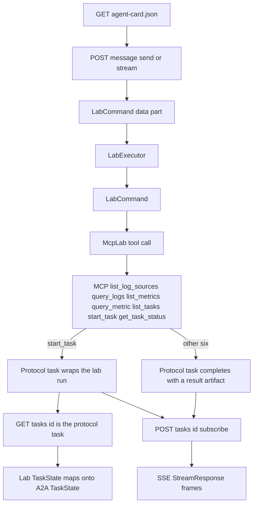

# A2A

## Role in this dev kit

A2A is one of the two agent-facing protocols. `A2aServer` speaks A2A 1.0 HTTP+JSON, JSON-RPC, and gRPC through the official `a2a-lf`, `a2a-server-lf`, `a2a-client-lf`, and `a2a-grpc` crates. `A2aClient` speaks HTTP+JSON. The default agent runs lab commands by calling the MCP tools on `http://127.0.0.1:31001/mcp` (`McpLab`). `A2aServer::new` still accepts any `LabApi`, including `LabService` for tests.

The seven lab operations are an A2A data-part profile. A message data part with media type `application/vnd.a2a-lab.v1+json` (`LAB_MEDIA_TYPE`) is a `LabCommand`. The matching artifact data part is a `LabResult`. Protocol task ids are A2A UUIDs. A started lab run keeps its own `run-*` id inside the `start_task` result. `GET /tasks/{id}` is the protocol task, not `list_tasks` / `get_task_status`.

## What this crate implements

The adapter lives in `src/a2a`. `A2A_PROTOCOL_VERSION` is `"1.0"`. HTTP+JSON routes are `POST /message:send`, `POST /message:stream`, `GET /tasks`, `GET /tasks/{id}`, `POST /tasks/{id}:cancel`, `POST /tasks/{id}:subscribe`, push-config CRUD, `GET /extendedAgentCard`, and `GET /.well-known/agent-card.json`. JSON-RPC is `POST /` on that same listener. gRPC is a second `127.0.0.1:0` listener.

Requests use `A2A-Version: 1.0` and `application/a2a+json`. Success bodies are ProtoJSON envelopes. Failures are `google.rpc.Status` with `ErrorInfo`. SSE frames are `StreamResponse` objects (`task`, `statusUpdate`, `artifactUpdate`, `message`).

`GET /.well-known/agent-card.json` returns a card named `a2a-lab`. Protocol version `1.0` sits on each interface, not the card root. The interfaces are `HTTP+JSON`, `JSONRPC` (the same origin), and `GRPC` (`host:port`, the form the official SDK writes for that binding). `streaming` is true. `pushNotifications` and `extendedAgentCard` are true only when those features are configured. Skills are `list-log-sources`, `query-logs`, `list-metrics`, `query-metric`, `list-tasks`, `start-task`, and `get-task-status`. Skill input and output modes are `LAB_MEDIA_TYPE`.

A present data-part `mediaType` other than `LAB_MEDIA_TYPE` returns the standard content-type error. Text parts without a lab command complete with a help artifact. Query-log and query-metric pages become one artifact chunk per item. Later chunks set `append`; the last chunk sets `lastChunk`.

`start_task` waits until the run is terminal unless `wait` is false. The A2A executor always starts the run without blocking the protocol request, then publishes status while it polls. `A2aServer::with_public_url` sets the advertised interface URL. `with_push_notifications` / `with_loopback_push`, `with_extended_card`, and `with_security` opt into optional capabilities. Disabled push and extended-card routes return the standard unsupported-operation errors.

Providers that cannot cancel a run return `TASK_NOT_CANCELABLE` rather than changing state. `MemoryTasks` can cancel a non-terminal run.

With no listener, `A2aServer::listen` binds `127.0.0.1:31000`.

`tests/a2a_compliance.rs` checks the HTTP+JSON wire contract, JSON-RPC envelopes, gRPC calls, SSE frames, and the `tck-*` message-id profiles. `mise run tck` runs the pinned official suite for `http_json`, `jsonrpc`, and `grpc` at MUST, SHOULD, and MAY, including advertised streaming. MUST failures fail the run. Optional capabilities are advertised only when they are implemented and configured. The pinned TCK still asserts success `Content-Type: application/json` (`HTTP_JSON-SVC-001`); this crate follows A2A 1.0 and the official SDK (`application/a2a+json`). The TCK task deselects that content-type assertion and keeps the schema half of the requirement. Error responses keep AIP-193 `google.rpc.Status` bodies; `TASK_NOT_CANCELABLE` maps to HTTP 409 and `CONTENT_TYPE_NOT_SUPPORTED` maps to HTTP 415. JSON-RPC errors stay HTTP 200 with the code in the envelope.

## Entry points

Re-exported from the crate root:

- `A2aServer::new`, `listen`, `with_public_url`, `with_push_notifications`, `with_loopback_push`, `with_extended_card`, and `with_security`
- `A2aClient::new`, the seven lab methods, `task`, `get_a2a_task`, `list_a2a_tasks`, `cancel`, `subscribe`, `send_stream`, push-config CRUD, `agent_card`, and `extended_agent_card`
- `bind_local`, `A2A_PROTOCOL_VERSION`, `LAB_MEDIA_TYPE`, `AgentCard`, `StreamResponse`, and `Task`

`A2aClient` sends to `POST /message:send` with role `ROLE_USER`. `subscribe` reads live `StreamResponse` frames until the stream ends.

## Related

- [Lab dev kit overview](<../../overview/doc-10 - Lab-dev-kit-overview.md>)
- [MCP](<../mcp/doc-5 - MCP.md>)
- [Lab dev kit architecture](<../../technical/architecture/doc-1 - Lab-dev-kit-architecture.md>)
- [A2A and MCP protocols](<../../technical/protocol/doc-2 - A2A-and-MCP-protocols.md>)
