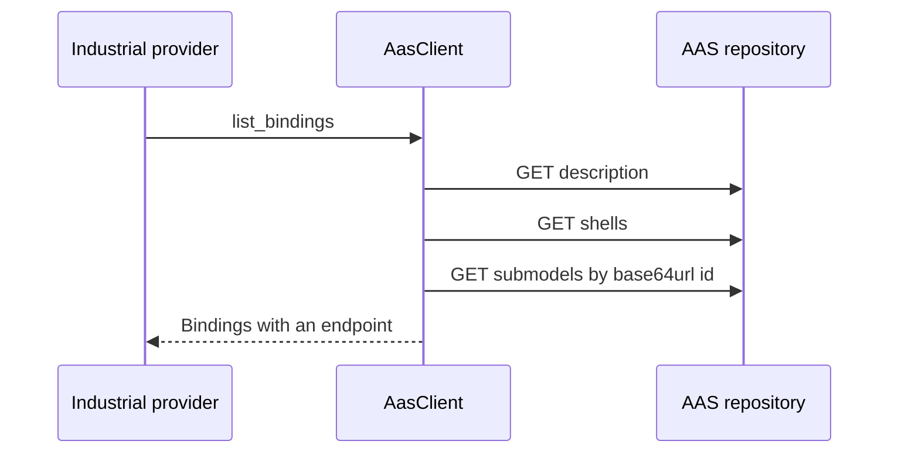

# Asset Administration Shell

## Role in A2A-LAB devkit

The Asset Administration Shell (AAS) HTTP repository is an outbound asset catalog. `AasClient` implements `AssetCatalogProvider`. Industrial log, metric, and task providers read bindings from that catalog. AAS is not one of the seven agent operations.

Industrial providers load bindings in this order:

An industrial provider calls `list_bindings` on `AasClient`. `AasClient` sends `GET description` to the AAS repository. `AasClient` sends `GET shells` to the repository. `AasClient` requests each submodel from the repository by its unpadded base64url id. `AasClient` returns the bindings and their endpoints to the provider.

## What this crate implements

The `aas` feature is on by default and compiles `a2a_lab_dev_kit::aas`.

- `AasClient::new` takes a base URL and an `AccessTokenSource`.
- `StaticToken::new(None)` sends no `Authorization` header.
- A present token is sent as a bearer credential.
- The first catalog read fills the cache from `description`, `shells`, and binding submodels.
- Later calls reuse that cache.
- HTTP 401 and HTTP 403 are `protocol` errors.
- HTTP 404 is `not_found`.
- Any other non-success status is `unavailable`.

The catalog read follows these rules:

- `description.profiles` must contain one string that includes both `3.2` and `AssetAdministrationShellRepositoryServiceSpecification`.
- Shells are the `result` array.
- Each asset key is the shell `id`.
- `assetInformation.globalAssetId` is optional.
- Binding submodels use semantic id `https://a2a-lab.example/LabBindings/1/0`.
- `list_bindings` pages every binding.
- `get_asset` looks up the cached shell id.

Binding elements describe an Open Platform Communications Unified Architecture (OPC UA) endpoint. Each element supplies:

- `labId`
- `role` of `log_source`, `metric`, or `task`
- `protocol` `opc_ua`
- the fields `Endpoint::OpcUa` requires

The binding semantic id is an IRI from the element, or the binding semantic id when the element has none.

## Entry points

With the `aas` feature:

- `aas::AasClient`
- `aas::AccessTokenSource` and `aas::StaticToken`
- `AssetCatalogProvider::list_assets`, `get_asset`, and `list_bindings`
- `MemoryCatalog`, an in-memory catalog

`AasClient` stays in the `aas` module. These catalog types are re-exported at the crate root:

- `Asset`
- `Binding`
- `Endpoint`
- `AssetKey`
- `SemanticId`

## Related

- [A2A-LAB devkit overview](<../../overview/doc-10 - Lab-dev-kit-overview.md>)
- [OPC UA](<../opc-ua/doc-7 - OPC-UA.md>)
- [Standardization in Lab Automation (SiLA) 2](<../sila-2/doc-8 - SiLA-2.md>)
- [Run a scripted industrial lab](<../../guide/scripted-industrial/doc-14 - Run-a-scripted-industrial-lab.md>)
