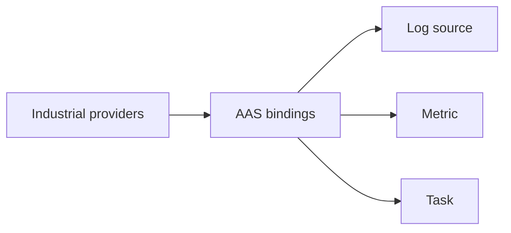

# AAS

[AAS](https://industrialdigitaltwin.org/en/) is the open standard for an industrial digital twin. It describes an asset and the data that asset exposes.

## Role in A2A-LAB devkit

AAS is a provider. It names the [A2A-LAB primitives](<../primitives/doc-17 - A2A-LAB-primitives.md>). `AasClient` reads the bindings. Industrial providers turn each binding into a log source, a metric, or a task.

The following diagram shows that mapping:

In the preceding diagram, industrial providers read AAS bindings. Each binding names one primitive id:

- Role `log_source` names a log source. `labId` is the source id.
- Role `metric` names a metric. `labId` is the metric id.
- Role `task` names a task. `labId` is the task id.

Log records, metric samples, and task runs come from the shared `LiveSource`.

## What this crate implements

The `aas` feature is on by default and compiles `a2a_lab_dev_kit::aas`.

- `AasClient::new` takes a base URL and an `AccessTokenSource`.
- `StaticToken::new(None)` sends no `Authorization` header.
- A present token is sent as a bearer credential.
- The first catalog read fills the cache from `description`, `shells`, and binding submodels.
- Later calls reuse that cache.
- HTTP 401 and HTTP 403 are `protocol` errors.
- HTTP 404 is `not_found`.
- Any other non-success status is `unavailable`.

The catalog read follows these rules:

- `description.profiles` must contain one string that includes both `3.2` and `AssetAdministrationShellRepositoryServiceSpecification`.
- Shells are the `result` array.
- Each asset key is the shell `id`.
- `assetInformation.globalAssetId` is optional.
- Binding submodels use semantic id `https://a2a-lab.example/LabBindings/1/0`.
- `list_bindings` pages every binding.
- `get_asset` looks up the cached shell id.

Each binding element supplies `labId`, a `role` of `log_source`, `metric`, or `task`, and the equipment endpoint.

The binding semantic id is an IRI from the element, or the binding semantic id when the element has none.

## Entry points

With the `aas` feature:

- `aas::AasClient`
- `aas::AccessTokenSource` and `aas::StaticToken`
- `AssetCatalogProvider::list_assets`, `get_asset`, and `list_bindings`
- `MemoryCatalog`, an in-memory catalog

`AasClient` stays in the `aas` module. These catalog types are re-exported at the crate root:

- `Asset`
- `Binding`
- `Endpoint`
- `AssetKey`
- `SemanticId`

## Related

- [Interfaces and providers](<../interfaces-and-providers/doc-19 - Interfaces-and-providers.md>)
- [A2A-LAB devkit overview](<../../overview/doc-10 - Lab-dev-kit-overview.md>)
- [A2A-LAB primitives](<../primitives/doc-17 - A2A-LAB-primitives.md>)
- [Implementations](<../implementations/doc-18 - Implementations.md>)
