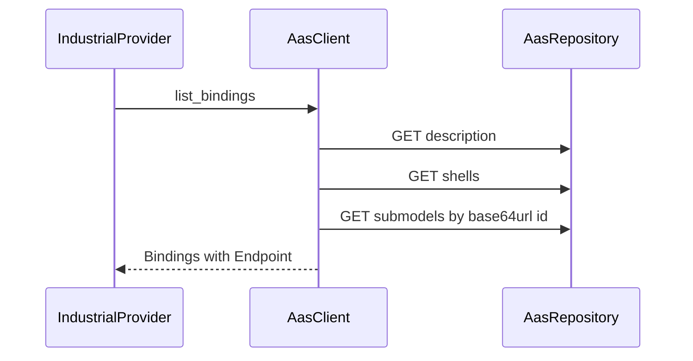

# Asset Administration Shell

## Role in this dev kit

The Asset Administration Shell HTTP repository is the outbound asset catalog. `AasClient` implements `AssetCatalogProvider`. Industrial log, metric, and task providers read bindings from that catalog. AAS is not one of the seven agent-facing operations.

The first catalog read fills the cache from `description`, `shells`, and binding submodels. Later calls reuse that cache.

## What this crate implements

The `aas` feature is on by default and compiles `a2a_lab_dev_kit::aas`. `AasClient::new` takes a base URL and an `AccessTokenSource`. `StaticToken::new(None)` sends no `Authorization` header. A token is sent as a bearer credential.

`list_assets` loads the catalog once and caches it. The client `GET`s `description`, then `shells`, then `submodels/{id}` for each submodel key. The submodel path segment is unpadded base64url of the identifier. `description.profiles` must contain a string that includes both `3.2` and `AssetAdministrationShellRepositoryServiceSpecification`. Shells are the `result` array. Each asset key is the shell `id`; `assetInformation.globalAssetId` is optional.

Binding submodels are those whose `semanticId` key value is `https://a2a-lab.example/LabBindings/1/0`. Each submodel element supplies `labId`, `role` (`log_source`, `metric`, or `task`), and `protocol` `opc_ua`, plus the fields required by `Endpoint::OpcUa`. The binding semantic id is an IRI taken from the element, or the binding semantic when the element has none. `list_bindings` pages every binding. `get_asset` looks up the cached shell id.

HTTP 401 and 403 are `protocol` errors. HTTP 404 is `not_found`. Any other non-success status is `unavailable`.

## Entry points

With the `aas` feature:

- `aas::AasClient`
- `aas::AccessTokenSource` and `aas::StaticToken`
- `AssetCatalogProvider::list_assets`, `get_asset`, and `list_bindings`
- `MemoryCatalog` for an in-memory catalog used by tests

`AasClient` is not re-exported at the crate root. Catalog types such as `Asset`, `Binding`, `Endpoint`, `AssetKey`, and `SemanticId` are.

## Related

- [Lab dev kit overview](<../../overview/doc-10 - Lab-dev-kit-overview.md>)
- [OPC UA](<../opc-ua/doc-7 - OPC-UA.md>)
- [SiLA 2](<../sila-2/doc-8 - SiLA-2.md>)
- [Industrial equipment connectors](<../../technical/industrial/doc-3 - Industrial-equipment-connectors.md>)
