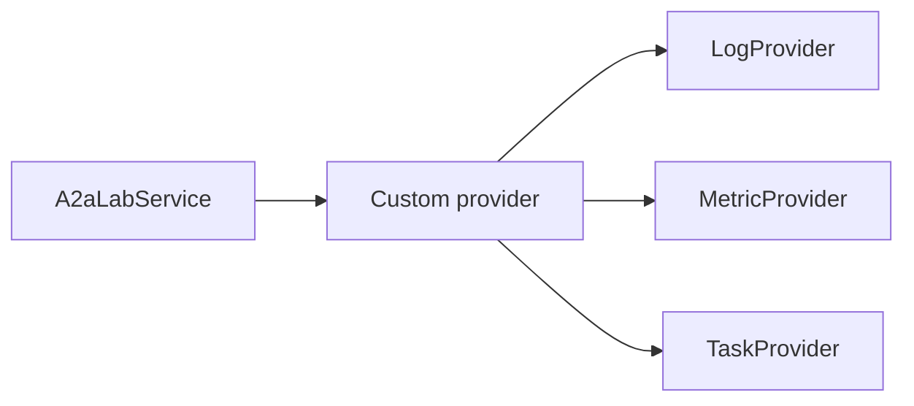

# Custom

A custom provider supplies lab logs, metrics, or tasks for equipment that uses its own interface.

## Role in A2A-LAB devkit

Custom is a provider. Implement `LogProvider`, `MetricProvider`, `TaskProvider`, or a combination of those traits. Pass the implementations to `A2aLabService`. A service can mix built-in providers and a custom provider.

The following diagram shows that contract:

In the preceding diagram, `A2aLabService` uses a custom provider. The custom provider implements `LogProvider`, `MetricProvider`, or `TaskProvider`.

The [A2A-LAB primitives](<../primitives/doc-17 - A2A-LAB-primitives.md>) define that contract. [Implementations](<../implementations/doc-18 - Implementations.md>) lists the built-in providers.

## Related

- [Interfaces and providers](<../interfaces-and-providers/doc-19 - Interfaces-and-providers.md>)
- [A2A-LAB devkit overview](<../../overview/doc-10 - Lab-dev-kit-overview.md>)
- [A2A-LAB primitives](<../primitives/doc-17 - A2A-LAB-primitives.md>)
- [Implementations](<../implementations/doc-18 - Implementations.md>)
