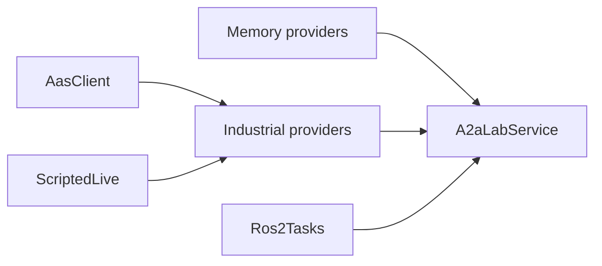

# Implementations

These types implement the [A2A-LAB primitives](<../primitives/doc-17 - A2A-LAB-primitives.md>) for `A2aLabService`.

## In this crate

The following diagram shows the provider implementations:

In the preceding diagram, memory providers, industrial providers, and `Ros2Tasks` implement the lab providers. `AasClient` and `ScriptedLive` back the industrial providers.

- `MemoryLogs`, `MemoryMetrics`, and `MemoryTasks` store logs, metrics, and tasks in memory.
- `MemoryCatalog` stores an asset catalog in memory.
- `AasClient` reads an Asset Administration Shell catalog.
- `IndustrialLogs`, `IndustrialMetrics`, and `IndustrialTasks` use one catalog and one `LiveSource`.
- `ScriptedLive` is the `LiveSource` in this crate.
- `OpcUaClient` supplies live OPC UA readings through `LiveSource`. [Upcoming]
- `Ros2Tasks` exposes Robot Operating System 2 (ROS 2) actions as tasks. `MemoryRos2` is the in-process graph.

## Example

[a2a-lab-ot2](https://github.com/A3Analytics/a2a-lab-ot2) is an example implementation. It wraps an Opentrons OT-2 simulator.
