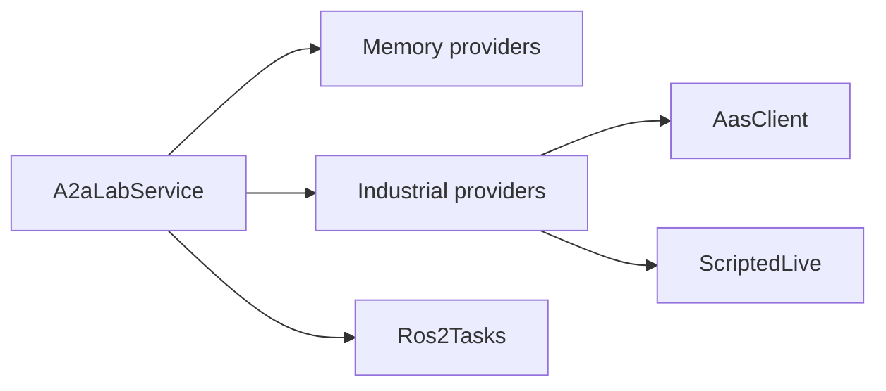

# Implementations

These types fulfill the [A2A-LAB primitives](<../primitives/doc-17 - A2A-LAB-primitives.md>) for `A2aLabService`. [Interfaces and providers](<../interfaces-and-providers/doc-19 - Interfaces-and-providers.md>) explains that role.

## In this crate

The following diagram shows the provider implementations:

In the preceding diagram, `A2aLabService` uses memory providers, industrial providers, and `Ros2Tasks`. Industrial providers use `AasClient` and `ScriptedLive`.

- Memory: `MemoryLogs`, `MemoryMetrics`, `MemoryTasks`, and `MemoryCatalog` store the lab in memory.
- Industrial: `IndustrialLogs`, `IndustrialMetrics`, and `IndustrialTasks` use one catalog and one `LiveSource`. `AasClient` reads an AAS catalog. `ScriptedLive` is the `LiveSource` in this crate. `OpcUaClient` supplies live Open Platform Communications Unified Architecture (OPC UA) readings through `LiveSource`. [Upcoming]
- Robot Operating System 2 (ROS 2): `Ros2Tasks` exposes ROS 2 actions as tasks. `MemoryRos2` is the in-process graph.

## Example

[a2a-lab-ot2](https://github.com/A3Analytics/a2a-lab-ot2) is an example implementation. It wraps an Opentrons OT-2 simulator.

## Related

- [Interfaces and providers](<../interfaces-and-providers/doc-19 - Interfaces-and-providers.md>)
- [A2A-LAB primitives](<../primitives/doc-17 - A2A-LAB-primitives.md>)
