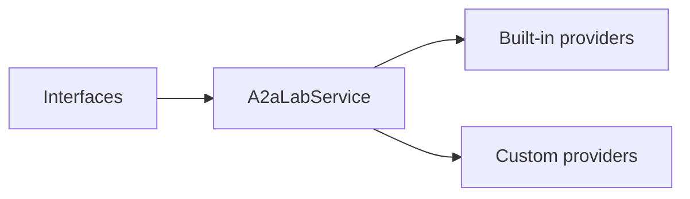

# Interfaces and providers

An interface exposes the A2A-LAB primitives to a client. A provider fulfills one or more of those primitives. `A2aLabService` connects the interfaces to the providers.

## How they connect

The following diagram shows that connection:

In the preceding diagram, interfaces call `A2aLabService`. `A2aLabService` uses built-in providers and custom providers.

## Interfaces

These interfaces are supported:

- [A2A](<../a2a/doc-4 - A2A.md>)
- [MCP](<../mcp/doc-5 - MCP.md>)
- [SiLA 2](<../sila-2/doc-8 - SiLA-2.md>)

## Providers

These providers are supported:

- [AAS](<../aas/doc-6 - Asset-Administration-Shell.md>)
- [OPC UA](<../opc-ua/doc-7 - OPC-UA.md>)
- [ROS 2](<../ros-2/doc-9 - ROS-2.md>)
- [SiLA 2](<../sila-2/doc-8 - SiLA-2.md>)
- [Custom](<../custom/doc-20 - Custom.md>)

## Related

- [A2A-LAB devkit overview](<../../overview/doc-10 - Lab-dev-kit-overview.md>)
- [A2A-LAB primitives](<../primitives/doc-17 - A2A-LAB-primitives.md>)
- [Implementations](<../implementations/doc-18 - Implementations.md>)
