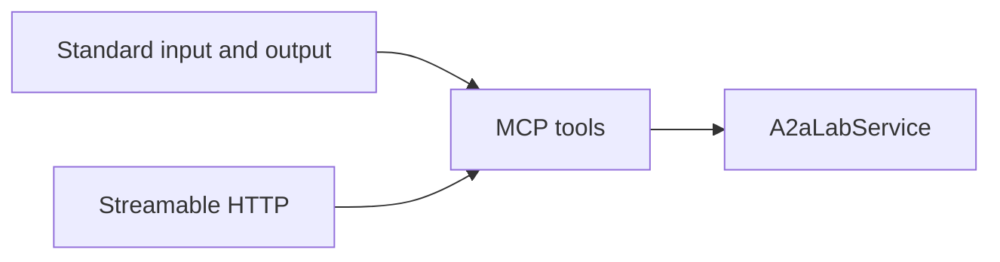

# MCP

This crate serves Model Context Protocol (MCP) tools for one lab.

## Role

`McpServer` registers tools on `A2aLabApi`.

The server name is `a2a-lab`.

The instructions are `Lab logs, metrics, and tasks`.

The tools are `list_log_sources`, `query_logs`, `list_metrics`, `query_metric`, `list_tasks`, `start_task`, and `get_task_status`.

What each tool does is on the [A2A-LAB devkit overview](<../../overview/doc-10 - Lab-dev-kit-overview.md>).

`McpLab::connect` implements `A2aLabApi` over Streamable HTTP.

Agent2Agent (A2A) uses that client to call the same tools.

## Transports

`McpServer` uses `rmcp` and protocol version `2026-07-28`.

`serve_stdio` uses standard input and output.

Those frames are newline-delimited JSON-RPC.

`serve_http` mounts `/mcp`.

With no listener, `serve_http` binds `127.0.0.1:31001`.

Both transports reach the same tools:

In the preceding diagram, standard input and output reach the MCP tools.

Streamable HTTP reaches those same tools.

The MCP tools call `A2aLabService`.

## Host allowlist

`serve_http` accepts these `Host` values:

- `localhost`
- `127.0.0.1`
- `::1`
- `host.docker.internal`

## Errors

`invalid`, `protocol`, and `not_found` become MCP invalid-params errors.

`unavailable` and `transport` become internal errors.

Each error includes the `A2aLabError` code.

## Wait

`start_task` waits until the run is terminal unless `wait` is false.

`timeout_seconds` defaults to 60.

## Related

- [A2A](<../a2a/doc-4 - A2A.md>)
- [Serve A2A and MCP](<../../guide/a2a-and-mcp/doc-13 - Serve-A2A-and-MCP.md>)
- [a2a_and_mcp.rs](../../../../examples/a2a_and_mcp.rs)
