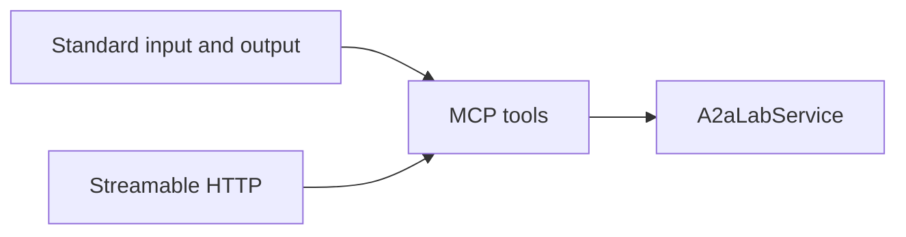
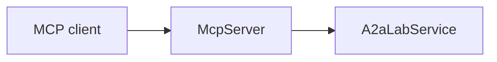

# MCP

[Model Context Protocol (MCP)](https://modelcontextprotocol.io/) is an open standard for connecting AI applications to external systems.

MCP is an interface. `McpServer` registers the seven lab operations as tools on `A2aLabApi`.

## Role

The server name is `a2a-lab`.

The instructions are `Lab logs, metrics, and tasks`.

The tools are `list_log_sources`, `query_logs`, `list_metrics`, `query_metric`, `list_tasks`, `start_task`, and `get_task_status`. Those operations are on the [A2A-LAB primitives](<../primitives/doc-17 - A2A-LAB-primitives.md>) page.

`McpLab::connect` implements `A2aLabApi` over Streamable HTTP. The [A2A](<../a2a/doc-4 - A2A.md>) page uses that client in the combined example.

## Transports

`McpServer` uses `rmcp` and protocol version `2026-07-28`.

`serve_stdio` uses standard input and output.

Those frames are newline-delimited JSON-RPC.

`serve_http` mounts `/mcp`.

With no listener, `serve_http` binds `127.0.0.1:31001`.

Both transports reach the same tools:



In the preceding diagram, standard input and output reach the MCP tools.

Streamable HTTP reaches those same tools.

The MCP tools call `A2aLabService`.

## Host allowlist

`serve_http` accepts these `Host` values:

- `localhost`
- `127.0.0.1`
- `::1`
- `host.docker.internal`

## Errors

`invalid`, `protocol`, and `not_found` become MCP invalid-params errors.

`unavailable` and `transport` become internal errors.

Each error includes the `A2aLabError` code.

## Wait

`start_task` waits until the run is terminal unless `wait` is false.

`timeout_seconds` defaults to 60.

## Example

The MCP client calls `McpServer` over Streamable HTTP with the `list_log_sources` tool. `McpServer` calls `A2aLabService`. The same example also calls the lab through A2A, and it prints both the A2A line and the MCP line.



In the preceding diagram, the MCP client calls `McpServer`, and `McpServer` calls `A2aLabService`.

```rust
fn spawn_mcp(
    service: Arc<dyn A2aLabApi>,
    listener: TcpListener,
) -> JoinHandle<Result<(), A2aLabError>> {
    tokio::spawn(async move { McpServer::new(&service).serve_http(listener).await })
}

// ...

let transport = StreamableHttpClientTransport::from_uri(format!("http://{mcp_address}/mcp"));
let mcp_client = ClientConfig::new(
    ClientCapabilities::default(),
    Implementation::new("a2a-lab-example", env!("CARGO_PKG_VERSION")),
)
.with_protocol_version(ProtocolVersion::V_2026_07_28)
.serve(transport)
.await?;
let arguments = serde_json::json!({"page": {"limit": 10}})
    .as_object()
    .cloned()
    .ok_or("tool arguments must be an object")?;
let page: Page<LogSource> = mcp_client
    .call_tool(CallToolRequestParams::new("list_log_sources").with_arguments(arguments))
    .await?
    .into_typed()?;
println!("mcp list_log_sources: {}", page.items()[0].id);
```

Run this command from the repository root:

```bash
mise exec -- cargo run --example a2a_and_mcp
```

The example prints:

```text
a2a list_log_sources: app
mcp list_log_sources: app
```

The full source is [a2a_and_mcp.rs](../../../../examples/a2a_and_mcp.rs). [Serve A2A and MCP](<../../guide/a2a-and-mcp/doc-13 - Serve-A2A-and-MCP.md>) walks through the same program.

## Related

- [Interfaces and providers](<../interfaces-and-providers/doc-19 - Interfaces-and-providers.md>)
- [A2A-LAB primitives](<../primitives/doc-17 - A2A-LAB-primitives.md>)
- [A2A](<../a2a/doc-4 - A2A.md>)
- [Serve A2A and MCP](<../../guide/a2a-and-mcp/doc-13 - Serve-A2A-and-MCP.md>)
- [a2a_and_mcp.rs](../../../../examples/a2a_and_mcp.rs)
