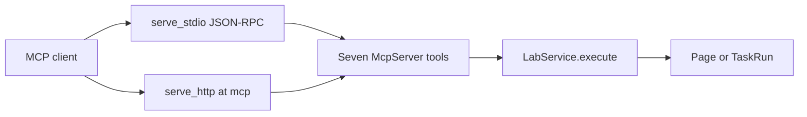

# MCP

## Role in this SDK

MCP is the other agent-facing protocol. `McpServer` registers the seven lab operations as tools on the same `LabApi` that `A2aServer` uses.

Both transports hit the same seven tools. Each tool calls `LabService.execute` and returns the unwrapped page or `TaskRun`.

## What this crate implements

`src/mcp` builds the server with `rmcp` 3.5. `get_info` advertises protocol version `2026-07-28` (`ProtocolVersion::V_2026_07_28`), server name `a2a-lab`, instructions `Lab logs, metrics, and tasks`, and the tools capability.

The tools are `list_log_sources`, `query_logs`, `list_metrics`, `query_metric`, `list_tasks`, `start_task`, and `get_task_status`. Each tool takes the same request type `LabService` accepts and returns the matching page or `TaskRun`.

`serve_stdio` speaks newline-delimited JSON-RPC on standard input and output. `serve_http` mounts Streamable HTTP at `/mcp`. With no listener it binds `127.0.0.1:31001`.

`invalid`, `protocol`, and `not_found` become MCP invalid-params errors. `unavailable` and `transport` become internal errors. `start_task` returns the run from `LabService` immediately. `get_task_status` is a separate call.

## Entry points

`McpServer` is re-exported from the crate root. Construct it with `McpServer::new` and serve with `serve_stdio` or `serve_http`.

## Related

- [Lab SDK overview](<../../overview/doc-10 - Lab-SDK-overview.md>)
- [A2A](<../a2a/doc-4 - A2A.md>)
- [Lab SDK architecture](<../../technical/architecture/doc-1 - Lab-SDK-architecture.md>)
- [A2A and MCP protocols](<../../technical/protocol/doc-2 - A2A-and-MCP-protocols.md>)
