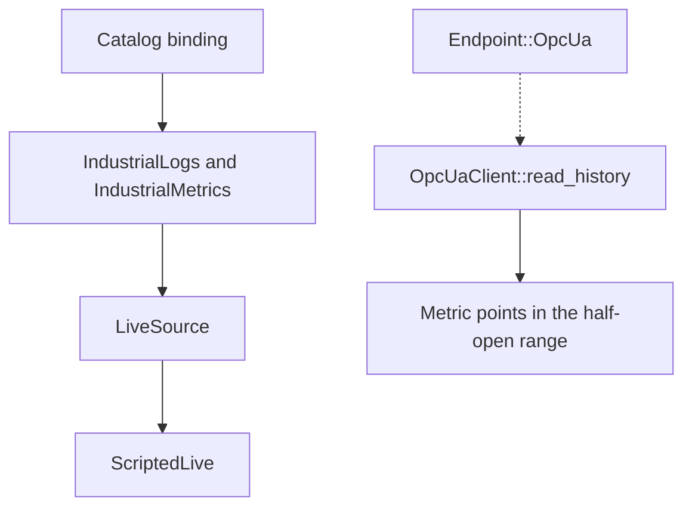

# OPC UA

## Role in A2A-LAB devkit

Open Platform Communications Unified Architecture (OPC UA) is an outbound history client. Industrial providers read history only through `LiveSource`. `ScriptedLive` is the `LiveSource` in this crate. `OpcUaClient::read_history` is a separate helper and is not a `LiveSource`.

Catalog bindings point a lab token at an `Endpoint::OpcUa` node. The industrial providers pass that endpoint to `LiveSource`. The helper reads one node on its own.

Industrial history and `OpcUaClient::read_history` follow different paths:

A catalog binding reaches `IndustrialLogs` and `IndustrialMetrics`. Those providers call `LiveSource`. `ScriptedLive` implements `LiveSource`. An `Endpoint::OpcUa` value reaches `OpcUaClient::read_history` on a separate path. That helper returns metric points inside the half-open range.

## What this crate implements

The `opcua` feature is on by default. It compiles `a2a_lab_dev_kit::opcua` against `async-opcua-client` 0.19.0.

`OpcUaClient::new` stores a PKI directory, a username, and a password. `read_history` takes an `Endpoint::OpcUa` value. It rejects a `security_policy` that contains `None`.

The session uses these settings:

- Automatic server trust is off (`trust_server_certs(false)`).
- Certificate verification is on (`verify_server_certs(true)`).
- Sample key pair creation is off (`create_sample_keypair(false)`).
- Authentication uses a username token.

The namespace index comes from the server namespace array for `namespace_uri`. The node id is `ns={index};{node_id}`.

The history read uses these settings:

- Raw data (`is_read_modified` is false)
- Source timestamps
- No bounds (`return_bounds` is false)
- No value cap (`num_values_per_node` is 0)

`BadHistoryOperationUnsupported` is `unavailable`. A history value without a source timestamp or a value is skipped. A value that is not a double is `invalid`. `filter_half_open` drops samples outside the lab range `[start, end)`. `namespace_index` returns the index of a URI in a namespace list, or `not_found`.

## Entry points

With the `opcua` feature:

- `opcua::OpcUaClient::read_history`
- `opcua::namespace_index`
- `opcua::filter_half_open`

These helpers stay in the `opcua` module. `Endpoint::OpcUa` is re-exported and carries these fields:

- `url`
- `security_policy`
- `security_mode`
- `identity`
- `node_id`
- `namespace_uri`
- `browse_path`

## Future work

Live OPC UA readings through `LiveSource`.

## Related

- [A2A-LAB devkit overview](<../../overview/doc-10 - Lab-dev-kit-overview.md>)
- [Asset Administration Shell](<../aas/doc-6 - Asset-Administration-Shell.md>)
- [Standardization in Lab Automation (SiLA) 2](<../sila-2/doc-8 - SiLA-2.md>)
- [Run a scripted industrial lab](<../../guide/scripted-industrial/doc-14 - Run-a-scripted-industrial-lab.md>)
