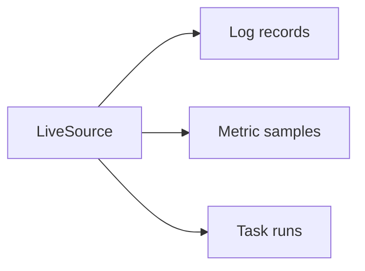

# OPC UA

[Open Platform Communications Unified Architecture (OPC UA)](https://opcfoundation.org/) is an open industrial standard for exchanging equipment data.

## Role in A2A-LAB devkit

OPC UA is a provider. It supplies values for the [A2A-LAB primitives](<../primitives/doc-17 - A2A-LAB-primitives.md>). A catalog binding names the OPC UA node. `LiveSource` reads that node.

The following diagram shows that mapping:



In the preceding diagram, `LiveSource` reads a bound OPC UA node. It returns log records, metric samples, and task runs:

- `query_logs` returns log records.
- `query_metric` returns metric samples.
- `start` and `status` return task runs.

`ScriptedLive` is the `LiveSource` in this crate. `OpcUaClient` supplies those readings through `LiveSource`. [Upcoming] `OpcUaClient::read_history` reads raw history for one node. [Implementations](<../implementations/doc-18 - Implementations.md>) lists both.

## What this crate implements

The `opcua` feature is on by default. It compiles `a2a_lab_dev_kit::opcua` against `async-opcua-client` 0.19.0.

`OpcUaClient::new` stores a PKI directory, a username, and a password. `read_history` takes an `Endpoint::OpcUa` value. It rejects a `security_policy` that contains `None`.

The session uses these settings:

- Automatic server trust is off (`trust_server_certs(false)`).
- Certificate verification is on (`verify_server_certs(true)`).
- Sample key pair creation is off (`create_sample_keypair(false)`).
- Authentication uses a username token.

The namespace index comes from the server namespace array for `namespace_uri`. The node id is `ns={index};{node_id}`.

The history read uses these settings:

- Raw data (`is_read_modified` is false)
- Source timestamps
- No bounds (`return_bounds` is false)
- No value cap (`num_values_per_node` is 0)

`BadHistoryOperationUnsupported` is `unavailable`. A history value without a source timestamp or a value is skipped. A value that is not a double is `invalid`. `filter_half_open` drops samples outside the lab range `[start, end)`. `namespace_index` returns the index of a URI in a namespace list, or `not_found`.

## Entry points

With the `opcua` feature:

- `opcua::OpcUaClient::read_history`
- `opcua::namespace_index`
- `opcua::filter_half_open`

These helpers stay in the `opcua` module. `Endpoint::OpcUa` is re-exported and carries these fields:

- `url`
- `security_policy`
- `security_mode`
- `identity`
- `node_id`
- `namespace_uri`
- `browse_path`

## Example

The metric query uses `ScriptedLive`. The catalog binding stores an `Endpoint::OpcUa` as catalog data: `url` is `opc.tcp://lab.example:4840`, `security_policy` is `http://opcfoundation.org/UA/SecurityPolicy#Basic256Sha256`, `security_mode` is `SignAndEncrypt`, `identity` is `Certificate`, `node_id` is `s=Temperature`, `namespace_uri` is `urn:lab:equipment`, and `browse_path` is empty. `ScriptedLive` supplies 21.5. The example opens neither an AAS repository nor an OPC UA server. `OpcUaClient` remains [Upcoming].


In the preceding diagram, the metric query uses `ScriptedLive`.

```rust
Endpoint::OpcUa {
    url: "opc.tcp://lab.example:4840".to_owned(),
    security_policy: "http://opcfoundation.org/UA/SecurityPolicy#Basic256Sha256".to_owned(),
    security_mode: SecurityMode::SignAndEncrypt,
    identity: OpcUaIdentityKind::Certificate,
    node_id: "s=Temperature".to_owned(),
    namespace_uri: "urn:lab:equipment".to_owned(),
    browse_path: String::new(),
}

let live = ScriptedLive::new();
live.insert_metric(MetricPoint::new(
    UtcTimestamp::parse("2024-01-01T00:30:00Z")?,
    21.5,
)?)
.await;

let samples = metrics
    .query(QueryMetricRequest {
        metric_id: MetricId::new("temperature")?,
        range: TimeRange::new(
            UtcTimestamp::parse("2024-01-01T00:00:00Z")?,
            UtcTimestamp::parse("2024-01-01T01:00:00Z")?,
        )?,
        page: PageRequest::new(None, 10)?,
    })
    .await?;
```

Run this command from the repository root:

```bash
mise exec -- cargo run --example industrial_scripted
```

The example prints:

```text
scripted temperature sample 21.5
```

The full source is [industrial_scripted.rs](../../../../examples/industrial_scripted.rs).

## Related

- [Interfaces and providers](<../interfaces-and-providers/doc-19 - Interfaces-and-providers.md>)
- [A2A-LAB devkit overview](<../../overview/doc-10 - Lab-dev-kit-overview.md>)
- [A2A-LAB primitives](<../primitives/doc-17 - A2A-LAB-primitives.md>)
- [Implementations](<../implementations/doc-18 - Implementations.md>)
