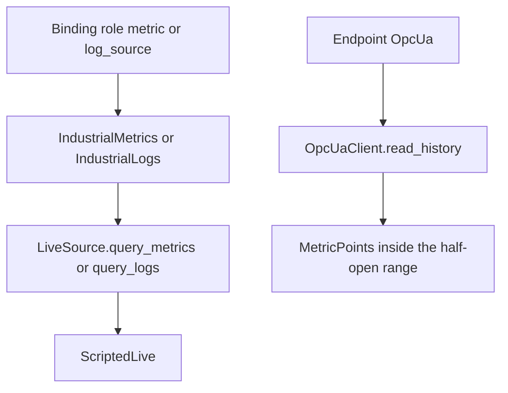

# OPC UA

## Role in this SDK

OPC UA is an outbound history client, not an agent-facing protocol. Catalog bindings may point a lab token at an `Endpoint::OpcUa` node. `IndustrialLogs`, `IndustrialMetrics`, and `IndustrialWorkflows` read history only through `LiveSource`. `OpcUaClient` is not a `LiveSource`.

Catalog bindings feed `LiveSource`. `ScriptedLive` is the implementation in this crate. `OpcUaClient::read_history` is a separate helper and is not wired into that path.

## What this crate implements

The `opcua` feature is on by default and compiles `a2a_lab_sdk::opcua` against `async-opcua-client` 0.19. The public surface is `OpcUaClient`, `OpcUaClient::read_history`, `namespace_index`, and `filter_half_open`.

`OpcUaClient::new` stores a PKI directory, username, and password. `read_history` requires an OPC UA endpoint. It rejects a `security_policy` that contains `None`. The session disables automatic server trust (`trust_server_certs(false)`), enables certificate verification (`verify_server_certs(true)`), does not create a sample key pair, and authenticates with a username token. The namespace index comes from the server namespace array for `namespace_uri`. The node id is `ns={index};{node_id}`.

The history read is raw data (`is_read_modified` false), with source timestamps, no bounds, and no value cap. Missing history support (`BadHistoryOperationUnsupported`) is `unavailable`. Each value must be a double with a source timestamp. `filter_half_open` drops samples that are not inside the lab range `[start, end)`. `namespace_index` returns the index of a URI in a namespace list, or `not_found`.

## Entry points

With the `opcua` feature, use `opcua::OpcUaClient::read_history`, `opcua::namespace_index`, and `opcua::filter_half_open`. These items are not re-exported at the crate root. `Endpoint::OpcUa` is re-exported and carries `url`, `security_policy`, `security_mode`, `identity`, `node_id`, `namespace_uri`, and `browse_path`.

## Related

- [Lab SDK overview](<../../overview/doc-10 - Lab-SDK-overview.md>)
- [Asset Administration Shell](<../aas/doc-6 - Asset-Administration-Shell.md>)
- [SiLA 2](<../sila-2/doc-8 - SiLA-2.md>)
- [Industrial equipment connectors](<../../technical/industrial/doc-3 - Industrial-equipment-connectors.md>)
