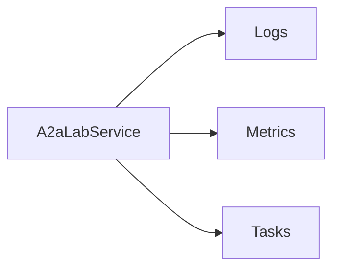

# A2A-LAB primitives

A2A-LAB primitives are the logs, metrics, and tasks shared by every interface and provider. [Interfaces and providers](<../interfaces-and-providers/doc-19 - Interfaces-and-providers.md>) names those two sides. The [A2A-LAB devkit overview](<../../overview/doc-10 - Lab-dev-kit-overview.md>) shows where they sit.

## Primitives

The following diagram shows the three primitives `A2aLabService` uses:

In the preceding diagram, `A2aLabService` uses logs, metrics, and tasks.

### Logs

A log source is a named stream. A log record is one line from that stream. Each record has a UTC timestamp, a severity, a message, and a JSON attribute object.

Severity is `trace`, `debug`, `info`, `warn`, or `error`.

### Metrics

A metric descriptor names one measurement and its unit. A metric point is one finite sample at a UTC timestamp.

### Tasks

A task definition is work an agent can start. It can carry JSON Schema for the input and the result. A task run is one start of that definition. The run input is a JSON object. A finished run can carry a JSON result, observable progress, and a SiLA error kind and identifier.

A run state is `submitted`, `working`, `completed`, `failed`, or `canceled`. `completed`, `failed`, and `canceled` are terminal.

## Operations

`A2aLabService` runs these operations:

1. `list_log_sources` lists log sources.
2. `query_logs` reads records for one source.
3. `list_metrics` lists metrics.
4. `query_metric` reads samples for one metric.
5. `list_tasks` lists tasks.
6. `start_task` starts a task.
7. `get_task_status` reads one run.

Time ranges are half-open Coordinated Universal Time (UTC) intervals, `[start, end)`.

## Shared values

These values apply to every primitive:

- An identifier is 1 to 128 characters. Allowed characters are ASCII letters, digits, `.`, `_`, `:`, and `-`.
- A timestamp is UTC in RFC 3339 form. The offset is `Z`, `+00:00`, or `-00:00`.
- A time range is half-open, `[start, end)`. `start` is included. `end` is excluded. `start` is before `end`.
- A page limit is 1 to 1000. The default limit is 100. A cursor is an optional string of digits.
- An error code is `invalid`, `not_found`, `unavailable`, `transport`, or `protocol`.
