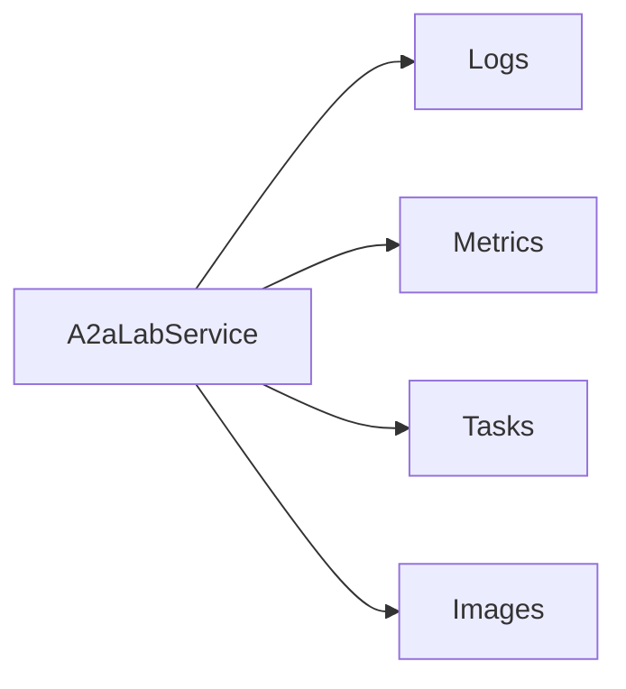

# A2A-LAB primitives

A2A-LAB primitives are the logs, metrics, tasks, and images shared by every interface and provider. [Interfaces and providers](<../interfaces-and-providers/doc-19 - Interfaces-and-providers.md>) names those two sides. The [A2A-LAB devkit overview](<../../overview/doc-10 - Lab-dev-kit-overview.md>) shows where they sit.

## Primitives

The following diagram shows the four primitives `A2aLabService` uses:

In the preceding diagram, `A2aLabService` uses logs, metrics, tasks, and images.

### Logs

A log source is a named stream. A log record is one line from that stream. Each record has a UTC timestamp, a severity, a message, and a JSON attribute object.

Severity is `trace`, `debug`, `info`, `warn`, or `error`.

### Metrics

A metric descriptor names one measurement and its unit. A metric point is one finite sample at a UTC timestamp.

### Tasks

A task definition is work an agent can start. It can carry JSON Schema for the input and the result. A task run is one start of that definition. The run input is a JSON object. A finished run can carry a JSON result, observable progress, and a SiLA error kind and identifier.

A run state is `submitted`, `working`, `completed`, `failed`, or `canceled`. `completed`, `failed`, and `canceled` are terminal.

### Images

An image source names a place that can supply frames. It has an id, a name, and a description. Optional fields are `asset_id` and `semantic_id`.

This crate does not open an HTTP endpoint, a USB device, or an IP camera. It does not include a source helper, a capture helper, or a built-in source adapter. A provider supplies the frames.

An image descriptor is metadata for one frame. It has an id, a source id, a Coordinated Universal Time (UTC) capture time, an `image/*` media type, a width, a height, an optional caption, and a JSON attribute object. A descriptor does not include pixel bytes.

An image pairs that descriptor with inline bytes. JSON carries those bytes as standard base64. Base64 uses four characters for every three decoded bytes, so the JSON text is about one third larger than the payload.

Limits apply to decoded bytes. `ImageTransportConfig` defaults to 64 MiB. A 3840x2160 payload at four bytes per pixel is about 31.6 MiB and fits that default. A large 24 megapixel PNG can exceed 64 MiB. `Image::new` uses the default. A provider that creates a larger payload uses `Image::with_transport`.

Configure the same decoded-byte maximum on the service and on each client. They do not share one limit automatically. `A2aLabService::with_image_transport` sets the service limit. `A2aClient::with_image_transport` sets the Agent2Agent (A2A) client limit. `McpLab::connect_with` sets the Model Context Protocol (MCP) client limit. `Image` JSON decoding stays at 64 MiB unless the caller passes the raised `ImageTransportConfig` into those methods. For MCP Streamable HTTP, pass the raised limit to `McpLab::connect_with` before the connection opens so the HTTP event window grows before the first image is read. `McpLab::with_image_transport` after connect changes decoding only.

`get_current_image` names a source. It is not an image lookup with a missing id. The provider defines the current frame. That frame can be newly captured, taken from video, or the latest stored image. `MemoryImages` uses `set_current` when a frame was selected. Otherwise it returns the latest captured frame for that source, with the image id as the tie break.

`A2aLabService::new` still takes logs, metrics, and tasks. Image operations return `unavailable` until `with_images`. MCP does not expose image resources. Agent2Agent (A2A) and MCP do not offer URI-only image delivery. SiLA 2 `LabImages` lists sources and returns one image by id or current source. Those pixel bytes always use SiLA binary download. Search and list-by-time stay on Agent2Agent (A2A) and Model Context Protocol (MCP).

## Operations

`A2aLabService` runs these operations:

1. `list_log_sources` lists log sources.
2. `query_logs` reads records for one source.
3. `list_metrics` lists metrics.
4. `query_metric` reads samples for one metric.
5. `list_tasks` lists tasks.
6. `start_task` starts a task.
7. `get_task_status` reads one run.
8. `list_image_sources` lists image sources.
9. `list_images` returns descriptors for one source. The page does not include pixel bytes.
10. `search_images` returns descriptors that match an optional source plus a half-open UTC range, nonblank text, or both. A source id alone is not a search. The page does not include pixel bytes.
11. `get_image` returns one image, including its inline base64 bytes.
12. `get_current_image` returns the provider-defined current frame for one source, including its inline base64 bytes.

Time ranges are half-open Coordinated Universal Time (UTC) intervals, `[start, end)`.

## Shared values

These values apply to every primitive:

- An identifier is 1 to 128 characters. Allowed characters are ASCII letters, digits, `.`, `_`, `:`, and `-`.
- A timestamp is UTC in RFC 3339 form. The offset is `Z`, `+00:00`, or `-00:00`.
- A time range is half-open, `[start, end)`. `start` is included. `end` is excluded. `start` is before `end`.
- A page limit is 1 to 1000. The default limit is 100. A cursor is an optional string of digits.
- An error code is `invalid`, `not_found`, `unavailable`, `transport`, or `protocol`.
