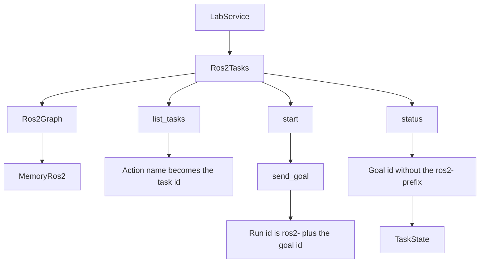

# ROS 2

## Role in this dev kit

ROS 2 action servers are exposed as lab tasks. `Ros2Tasks` implements `TaskProvider`. It does not implement `LogProvider` or `MetricProvider`, and it is not an A2A or MCP adapter.

`Ros2Tasks` is a `TaskProvider` over an in-process `Ros2Graph`. Action names become task ids. Goal status becomes `TaskState`. There is no DDS or RCL link.

## What this crate implements

`src/ros2` is always compiled. It does not link DDS or RCL. The graph is the in-process `Ros2Graph` trait. `MemoryRos2` is the implementation in this crate: the caller advertises actions and later updates goal status.

`Ros2Tasks::list_tasks` sorts advertised actions by name. A task id is the action name with leading and trailing `/` removed, `/` replaced by `:`, and spaces replaced by `_`. The task name is the original action name. The description and `semantic_id` are the action type name. `asset_id` is absent.

`start` turns the task id back into `/segment/segment` and calls `Ros2Graph::send_goal` with the JSON object. `MemoryRos2::send_goal` ignores that object, requires the action to be advertised, and stores a goal `goal-{n}` in `Ros2GoalStatus::Accepted`. The lab run id is `ros2-{goal id}`. Goal status maps as follows: `Accepted` to `Submitted`, `Executing` and `Canceling` to `Working`, `Succeeded` to `Completed`, `Aborted` to `Failed`, and `Canceled` to `Canceled`.

`status` strips a `ros2-` prefix, loads the goal, and returns a run whose `input` is an empty JSON object. `MemoryRos2::set_status` is how a caller records a later goal state and optional message.

## Entry points

Re-exported from the crate root:

- `Ros2Tasks::new` and `Ros2Tasks::graph`
- `Ros2Graph`
- `MemoryRos2::new`, `advertise`, and `set_status`
- `Ros2Action`, `Ros2Goal`, and `Ros2GoalStatus`

Pass `Ros2Tasks` to `LabService::new` as the task provider.

## Related

- [Lab dev kit overview](<../../overview/doc-10 - Lab-dev-kit-overview.md>)
- [A2A](<../a2a/doc-4 - A2A.md>)
- [MCP](<../mcp/doc-5 - MCP.md>)
- [Lab dev kit architecture](<../../technical/architecture/doc-1 - Lab-dev-kit-architecture.md>)
