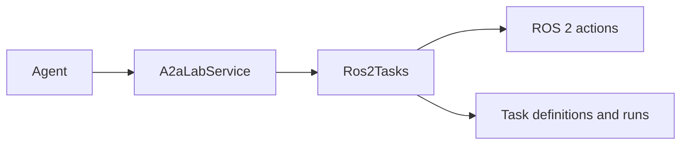

# ROS 2

## Role in A2A-LAB devkit

Robot Operating System 2 (ROS 2) fulfills the task primitive. `Ros2Tasks` turns advertised actions into tasks for `A2aLabService`.

The following diagram shows that mapping:

In the preceding diagram, an agent calls `A2aLabService`. `A2aLabService` calls `Ros2Tasks`. `Ros2Tasks` reads ROS 2 actions and returns task definitions and task runs.

`list_tasks` lists the actions. `start` sends a goal. `get_task_status` reads that goal. `MemoryRos2` is the in-process graph in this crate. A graph over Data Distribution Service (DDS) and the ROS Client Library (RCL) is [Upcoming].

## What this crate implements

The graph is the `Ros2Graph` trait. `MemoryRos2` is the in-process graph in this crate. The crate includes the `ros2` module in every build.

Action names become task ids. Goal status maps to `TaskState`. The task name stays the action name. The description and `semantic_id` are the action type name. `asset_id` is absent.

The id mapping has three parts:

- `list_tasks` sorts advertised actions by name. The task id drops leading and trailing `/` characters, replaces `/` with `:`, and replaces spaces with `_`.
- `start` replaces `:` with `/`, adds a leading `/`, and calls `send_goal` with the JSON object. The run id is `ros2-` plus the goal id.
- `status` removes a leading `ros2-` and loads that goal. The returned task id uses the same action-name rules as `list_tasks`. The returned input is an empty JSON object.

`MemoryRos2::send_goal` ignores the JSON object. The call requires an advertised action. The new goal id is `goal-{n}` and the status is `Accepted`. `set_status` records the goal status and an optional message.

These pairs map goal status to `TaskState`:

- `Accepted` maps to `Submitted`.
- `Executing` and `Canceling` map to `Working`.
- `Succeeded` maps to `Completed`.
- `Aborted` maps to `Failed`.
- `Canceled` maps to `Canceled`.

## Entry points

The crate root re-exports these types:

- `Ros2Tasks`, with `new` and `graph`
- `Ros2Graph`
- `MemoryRos2`, with `new`, `advertise`, and `set_status`
- `Ros2Action`, `Ros2Goal`, and `Ros2GoalStatus`

Pass `Ros2Tasks` to `A2aLabService::new` as the task provider. `Ros2Tasks::graph` returns the graph so the caller can advertise actions and update goals.

## Related

- [A2A-LAB devkit overview](<../../overview/doc-10 - Lab-dev-kit-overview.md>)
- [A2A-LAB primitives](<../primitives/doc-17 - A2A-LAB-primitives.md>)
- [Expose ROS 2 actions as tasks](<../../guide/ros2-tasks/doc-15 - Expose-ROS-2-actions-as-tasks.md>)
