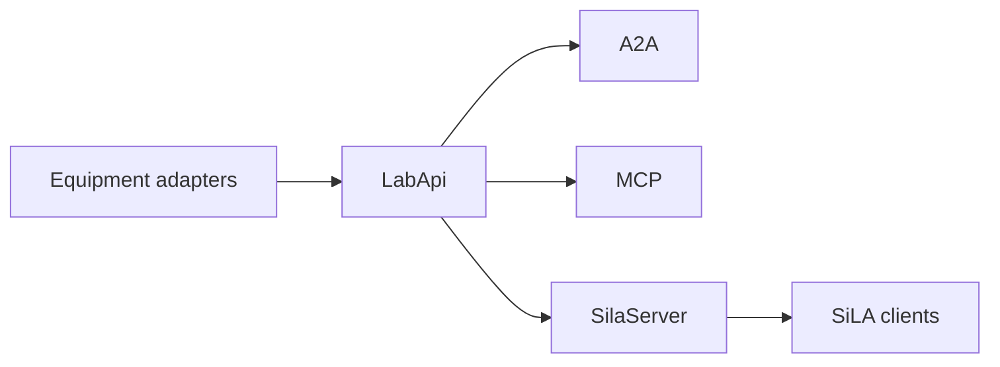

# SiLA 2

## Role in this dev kit

SiLA 2 is an inbound Feature Provider. The devkit sits in front of lab equipment and serves that equipment to SiLA clients. `SilaServer` uses the same `LabApi` as A2A and MCP. It does not connect to a remote SiLA device.

## What this crate serves

The `sila2` feature is on by default. The server implements three features:

- `org.silastandard/core/SiLAService/v1`
- `com.a3analytics/lab/LabOperations/v1`
- `org.silastandard/core/commands/CancelController/v1`

`LabOperations` is one stable feature for the seven lab operations. `ListLogSources`, `QueryLogs`, `ListMetrics`, `QueryMetric`, `ListTasks`, and `GetTaskStatus` are unobservable commands. `StartTask` is observable. Pages, time ranges, records, and task runs are SiLA structures. Task input and log attributes are JSON strings of at most 262144 characters. The feature declares no SiLA `Binary` fields, so binary transfer is not part of this profile. Client metadata, locking, authorization, and server-initiated connections are not advertised.

`CancelController.CancelCommand` cancels the lab run behind a `StartTask` execution. The execution UUID is a constrained string on that command, which is the SiLA String both this server and the official dynamic client use. A canceled execution finishes with an error. A provider that cannot cancel returns `OperationNotSupported`.

## Identity and discovery

`SilaIdentity` requires a stable lowercase server UUID, a server type matching `[A-Z][a-zA-Z0-9]*`, a `major.minor` version, and an `http` or `https` vendor URL. `SetServerName` updates the published name and writes it when a name file is configured.

The encrypted listener is the default. Its certificate uses common name `SiLA2`, a `DNS:SiLA2` subject alternative name, and the server UUID in extension `1.3.6.1.4.1.58583`. `SilaServer::plaintext` is the explicit unencrypted listener. After the socket is bound, `announce` publishes `_sila._tcp.local.` with protocol `version=1.1`, the server name, type, description, vendor URL, and CA lines `ca0`, `ca1`, and so on. Dropping the server handle withdraws that advertisement.

## Interop

`mise run sila2-interop` starts this server and runs the pinned official `sila_csharp` v.10.3.2 dynamic client, commit `2625cce6541c501cb951f2eea95d490a2efd12c0`. The report records `role: feature_provider`, image ids, and a failure when a required capability fails. It does not use the official SiLA logo and it is not a certification claim.

## Entry points

With the `sila2` feature, use `sila::SilaServer`, `sila::SilaIdentity`, and `sila::SilaCertificate`. These items are not re-exported at the crate root. `examples/sila2_server.rs` serves one memory-backed lab over A2A, MCP, and SiLA.

## Related

- [Lab dev kit overview](<../../overview/doc-10 - Lab-dev-kit-overview.md>)
- [Asset Administration Shell](<../aas/doc-6 - Asset-Administration-Shell.md>)
- [OPC UA](<../opc-ua/doc-7 - OPC-UA.md>)
- [Industrial equipment connectors](<../../technical/industrial/doc-3 - Industrial-equipment-connectors.md>)
