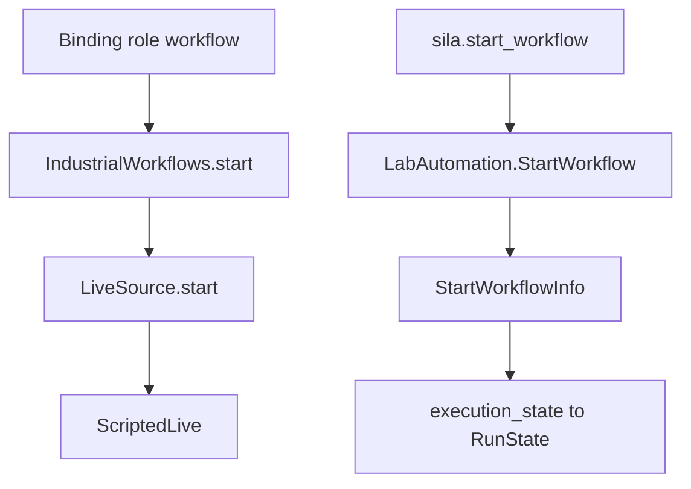

# SiLA 2

## Role in this SDK

SiLA 2 is an outbound helper surface for one checked-in lab service, not an agent-facing protocol. Catalog bindings may store an `Endpoint::Sila2` feature member. `IndustrialWorkflows` starts commands only through `LiveSource`. Nothing in `src/sila` implements `LiveSource`.

Workflow bindings start through `LiveSource`. `sila::start_workflow` is a separate helper that maps the first `LabAutomation` status onto `RunState`.

## What this crate implements

The `sila2` feature is on by default. `build.rs` compiles the checked-in `proto/sila/lab.proto` into `sila::proto`. That file declares package `sila.lab` and service `LabAutomation`, with RPCs `GetAvailableWorkflows`, `StartWorkflow`, `StartWorkflowInfo`, `StartWorkflowResult`, `GetWorkflowLogs`, `GetWorkflowMetrics`, `CreateBinary`, and `UploadChunk`. The proto comment says observable-command status codes follow sila_base v1.2 shapes: 0 waiting, 1 running, 2 finished successfully, 3 finished with error. The file is a custom proto, not generated from Feature XML.

Public helpers in `sila` are:

- `execution_state` maps status `0` to `Submitted`, `1` to `Working`, `2` to `Completed`, and `3` to `Failed`. Any other code is a protocol error.
- `parse_discovery` accepts service type `_sila._tcp.local.` only, and requires a non-empty host, non-zero port, and non-empty server UUID. It returns a `SilaEndpoint`.
- `certificate_accepted` requires common name `SiLA2` and equal advertised and certificate UUIDs. It compares strings.
- `chunk_binary` splits bytes into slices of at most `MAX_CHUNK` (`2 * 1024 * 1024`). An empty input returns no chunks.
- `start_workflow` calls the generated `LabAutomationClient::start_workflow` and `start_workflow_info`, then maps the first `ExecutionInfo` status with `execution_state`.

## Entry points

With the `sila2` feature, use `sila::MAX_CHUNK`, `sila::SilaEndpoint`, `sila::execution_state`, `sila::parse_discovery`, `sila::certificate_accepted`, `sila::chunk_binary`, `sila::start_workflow`, and the generated `sila::proto` module. These items are not re-exported at the crate root. `Endpoint::Sila2` is re-exported and stores `host`, `port`, `feature`, `member`, and `version`.

## Related

- [Lab SDK overview](<../../overview/doc-10 - Lab-SDK-overview.md>)
- [Asset Administration Shell](<../aas/doc-6 - Asset-Administration-Shell.md>)
- [OPC UA](<../opc-ua/doc-7 - OPC-UA.md>)
- [Industrial equipment connectors](<../../technical/industrial/doc-3 - Industrial-equipment-connectors.md>)
