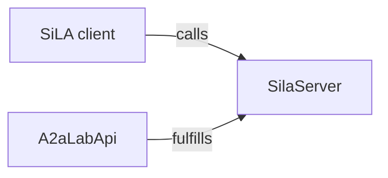
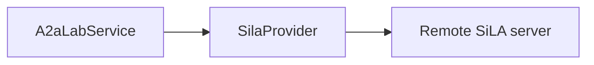
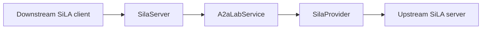

# SiLA 2

[Standardization in Lab Automation (SiLA) 2](https://sila-standard.com/) is an open standard for connecting lab instruments and software.

## Role in A2A-LAB devkit

SiLA 2 is both an interface and a provider. A SiLA client calls `SilaServer`. `A2aLabApi` fulfills `SilaServer` with the [A2A-LAB primitives](<../primitives/doc-17 - A2A-LAB-primitives.md>). `SilaProvider` connects to a remote SiLA server and fulfills logs, metrics, and tasks. `SilaProvider` does not implement `ImageProvider`.

The following diagram shows that path:



In the preceding diagram, a SiLA client calls `SilaServer`. `A2aLabApi` fulfills `SilaServer`.

## What this crate serves

The `sila2` feature is on by default. The lab profile uses these features:

- `org.silastandard/core/SiLAService/v1`
- `com.a3analytics/lab/LabOperations/v1`
- `com.a3analytics/lab/LabImages/v1`
- `org.silastandard/core/commands/CancelController/v1`

`LabOperations` covers logs, metrics, and tasks. It has these seven operations:

- `ListLogSources`, `QueryLogs`, `ListMetrics`, `QueryMetric`, `ListTasks`, and `GetTaskStatus` are unobservable commands.
- `StartTask` is observable.

Pages, time ranges, records, and task runs are SiLA structures. Task input and log attributes are JSON strings of at most 262144 characters. `LabOperations` declares no SiLA `Binary` fields.

`LabImages` lists image sources and returns one image. `ListImageSources` returns a page of named sources and what each source captures. `GetImage` reads one stored image by id. `GetCurrentImage` reads the provider-defined current frame for one source. Search and list-by-time stay on Agent2Agent (A2A) and Model Context Protocol (MCP).

Every image uses SiLA binary download, including a payload under 2 MiB. The command response carries metadata and a `binaryTransferUUID`. The client calls `BinaryDownload.GetBinaryInfo`, `GetChunk`, and `DeleteBinary` for the pixel bytes. The cloud connector does not proxy `LabImages` or `BinaryDownload`.

`CancelController.CancelCommand` cancels the lab run behind a `StartTask` execution. The execution id must be a lowercase UUID. A canceled execution finishes with `canceled`. A provider that cannot cancel returns `OperationNotSupported`.

## Identity and discovery

`SilaIdentity` requires these values:

- A stable lowercase server UUID
- A server type matching `[A-Z][a-zA-Z0-9]*`
- A `major.minor` version, with an optional patch and an optional suffix
- An `http` or `https` vendor URL

`SetServerName` updates the published name. It writes that name when a name file is configured.

The encrypted listener is the default. Its certificate uses these values:

- Common name `SiLA2`
- Subject alternative name `DNS:SiLA2`
- Server UUID in extension `1.3.6.1.4.1.58583`

`SilaServer::plaintext` is the unencrypted listener. After the socket is bound, `announce` publishes `_sila._tcp.local.` with these records:

- Protocol `version=1.1`
- Server name, type, description, and vendor URL
- CA lines `ca0`, `ca1`, and so on when a certificate is present

Dropping the server handle withdraws that advertisement.

## Interop

`mise run sila2-interop` starts this server and runs the pinned official `sila_csharp` v.10.3.2 dynamic client, commit `2625cce6541c501cb951f2eea95d490a2efd12c0`. The report records `role: feature_provider`, the server and client container-image identifiers, and a failure when a required capability fails. Those identifiers name the Docker images used for the run. They are not lab image ids. It does not use the official SiLA logo and it is not a certification claim.

## Remote provider

The following diagram shows the provider path:



In the preceding diagram, `A2aLabService` uses `SilaProvider`. `SilaProvider` calls a remote SiLA server.

`SilaProviderConfig` names the remote host, port, and server UUID. Encrypted connections are the default. `ca_pem` must be a SiLA certificate whose common name is `SiLA2` and whose UUID extension matches the server. `plaintext` is the unencrypted development listener.

Each binding assigns one feature command or readable property to `task`, `logs`, or `metric`. The same member can appear in more than one binding. Nothing is classified automatically.

A task binding uses the Feature Definition for its input and output JSON Schema. An observable command keeps progress and can be canceled. A log or metric binding calls its member when the lab query arrives. JSON pointers select the returned records or samples, and the provider keeps the requested half-open UTC range. There is no background collection.

`SilaProvider` implements `LogProvider`, `MetricProvider`, and `TaskProvider`. It does not implement `ImageProvider`. Pass one cloned value to each argument of `A2aLabService::new`. Image operations on that service stay unavailable until a separate `ImageProvider` is attached.

The [SiLA provider example](../../../../examples/sila_provider.rs) (`examples/sila_provider.rs`) reads one remote log command.

## Use SiLA as both provider and interface

One process can consume an upstream SiLA server and serve those configured members to downstream SiLA clients:



In this arrangement, `SilaProvider` is the outbound provider and `SilaServer` is the inbound interface. `A2aLabService` connects the two roles.

```rust
use a2a_lab_dev_kit::sila::{
    SilaCertificate, SilaIdentity, SilaProvider, SilaProviderConfig, SilaServer,
    SilaServerHandle,
};
use a2a_lab_dev_kit::{A2aLabError, A2aLabService};

async fn serve_remote_sila(
    config: SilaProviderConfig,
    identity: SilaIdentity,
    certificate: SilaCertificate,
) -> Result<SilaServerHandle, A2aLabError> {
    let provider = SilaProvider::connect(config).await?;
    let lab = A2aLabService::new(provider.clone(), provider.clone(), provider).share();

    SilaServer::new(identity, lab)
        .certificate(certificate)
        .announce()
        .serve("0.0.0.0:50052".parse().expect("valid address"))
        .await
}
```

The provider configuration selects the upstream members. The server identity and certificate describe this process to downstream clients. The two server UUIDs are independent.

`mise run sila2-consumer-interop` runs this consumer against the pinned official `sila_csharp` v.10.3.2 integration server, commit `2625cce6541c501cb951f2eea95d490a2efd12c0`. Its report is separate from the Feature Provider report. It does not use the official SiLA logo and it is not a certification claim.

## Entry points

With the `sila2` feature:

- `sila::SilaServer`
- `sila::SilaIdentity`
- `sila::SilaCertificate`
- `sila::SilaProvider`
- `sila::SilaProviderConfig`

These types stay in the `sila` module. The [SiLA interface example](../../../../examples/sila_interface.rs) (`examples/sila_interface.rs`) serves this lab to SiLA clients.

## Related

- [Interfaces and providers](<../interfaces-and-providers/doc-19 - Interfaces-and-providers.md>)
- [A2A-LAB devkit overview](<../../overview/doc-10 - Lab-dev-kit-overview.md>)
- [A2A-LAB primitives](<../primitives/doc-17 - A2A-LAB-primitives.md>)
