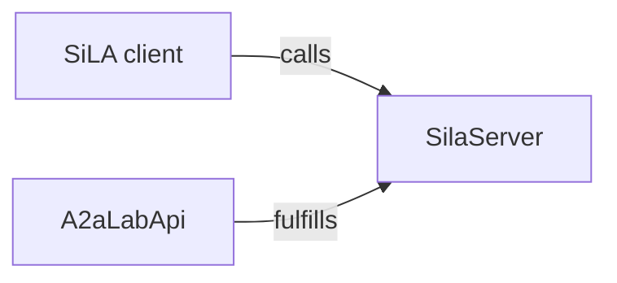

# SiLA 2

## Role in A2A-LAB devkit

Standardization in Lab Automation (SiLA) 2 is an interface. A SiLA client calls `SilaServer`. `A2aLabApi` fulfills `SilaServer` with the [A2A-LAB primitives](<../primitives/doc-17 - A2A-LAB-primitives.md>).

The following diagram shows that path:

In the preceding diagram, a SiLA client calls `SilaServer`. `A2aLabApi` fulfills `SilaServer`.

## What this crate serves

The `sila2` feature is on by default. The lab profile uses these features:

- `org.silastandard/core/SiLAService/v1`
- `com.a3analytics/lab/LabOperations/v1`
- `org.silastandard/core/commands/CancelController/v1`

`LabOperations` covers the seven lab operations:

- `ListLogSources`, `QueryLogs`, `ListMetrics`, `QueryMetric`, `ListTasks`, and `GetTaskStatus` are unobservable commands.
- `StartTask` is observable.

Pages, time ranges, records, and task runs are SiLA structures. Task input and log attributes are JSON strings of at most 262144 characters. The feature declares no SiLA `Binary` fields.

`CancelController.CancelCommand` cancels the lab run behind a `StartTask` execution. The execution id must be a lowercase UUID. A canceled execution finishes with `canceled`. A provider that cannot cancel returns `OperationNotSupported`.

## Identity and discovery

`SilaIdentity` requires these values:

- A stable lowercase server UUID
- A server type matching `[A-Z][a-zA-Z0-9]*`
- A `major.minor` version, with an optional patch and an optional suffix
- An `http` or `https` vendor URL

`SetServerName` updates the published name. It writes that name when a name file is configured.

The encrypted listener is the default. Its certificate uses these values:

- Common name `SiLA2`
- Subject alternative name `DNS:SiLA2`
- Server UUID in extension `1.3.6.1.4.1.58583`

`SilaServer::plaintext` is the unencrypted listener. After the socket is bound, `announce` publishes `_sila._tcp.local.` with these records:

- Protocol `version=1.1`
- Server name, type, description, and vendor URL
- CA lines `ca0`, `ca1`, and so on when a certificate is present

Dropping the server handle withdraws that advertisement.

## Interop

`mise run sila2-interop` starts this server and runs the pinned official `sila_csharp` v.10.3.2 dynamic client, commit `2625cce6541c501cb951f2eea95d490a2efd12c0`. The report records `role: feature_provider`, image ids, and a failure when a required capability fails. It does not use the official SiLA logo and it is not a certification claim.

## Entry points

With the `sila2` feature:

- `sila::SilaServer`
- `sila::SilaIdentity`
- `sila::SilaCertificate`

These types stay in the `sila` module. The [SiLA server example](../../../../examples/sila2_server.rs) (`examples/sila2_server.rs`) runs this Feature Provider.

## Related

- [Interfaces and providers](<../interfaces-and-providers/doc-19 - Interfaces-and-providers.md>)
- [A2A-LAB devkit overview](<../../overview/doc-10 - Lab-dev-kit-overview.md>)
- [A2A-LAB primitives](<../primitives/doc-17 - A2A-LAB-primitives.md>)
